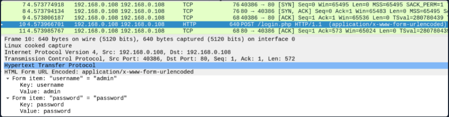
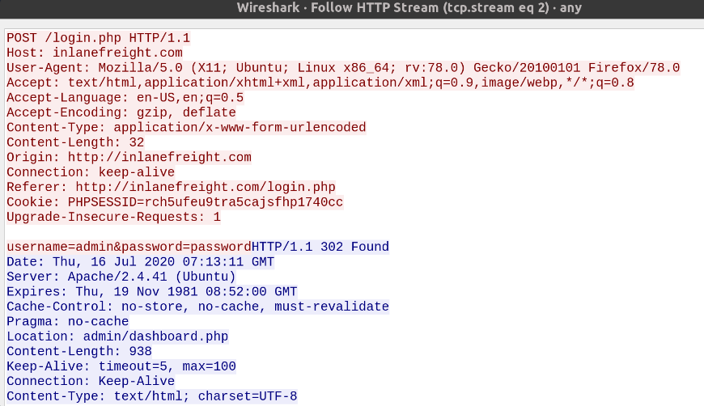
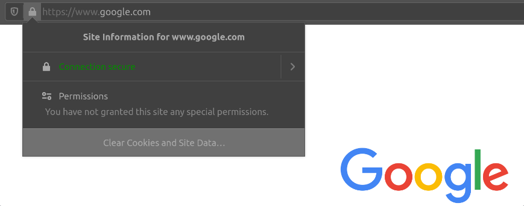
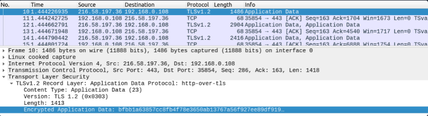
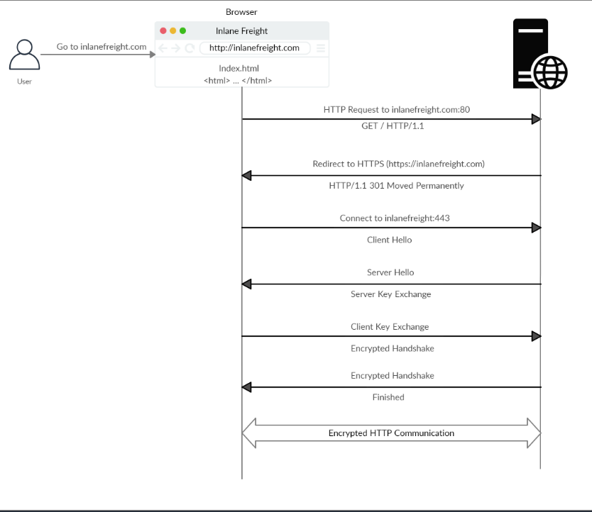

## Hypertext Transfer Protocol Secure (HTTPS)

## BY: HTB Academy

## HTTPS Overview

- One of the major drawbacks of HTTP is that all data is transferred in clear text, meaning anyone between the source and destination can perform a Man-in-the-middle (MiTM) attack to view the transferred data.

- This can be examined by using a network analyzer such as Wireshark.

- As seen below, an attacker who captures the network traffic would be able to view the entire login sequence, showing the login request (along with the supplied username and password) and the redirection to an administrative dashboard page after a successful login attempt.

- These drawbacks gave rise to the **HTTPS (HTTP Secure) protocol.** When this protocol is enabled, all communication between the client (user accessing a web application via their web browser), and the webserver that hosts the web application, is encrypted.

- When HTTPS is implemented on a web application, it becomes impossible for anyone to intercept and analyze the traffic and capture information such as credentials and other sensitive data.

- Websites that enforce HTTPS can be identified through **https://** in the **URL** (i.e. https://google.com) as well as the lock icon in the address bar of the web browser to the left of the URL.

- The default **port** for HTTPS is 443, which is prefered by browsers over HTTP over 80. provided there are no misconfigurations that allow a user to browse an insecure HTTP version of a website instead of the HTTPS version.

- Running Wireshark while browsing to **https://google.com** shows traffic passing over the network encrypted.

- In the example above, we can see that all traffic when browsing to **https://google.com** is encrypted.

## HTTPS Flow

- Upon browsing to **http://inlanefreight.com,** the browser attempts to resolve the domain and redirects the user to the webserver hosting the target website.

- A request is sent to port 80 first, which is the unencrypted HTTP protocol. The server detects this and redirects the client to secure HTTPS port 443 instead. This is done via the **301 Moved Permanently** response code.

- The client (web browser) sends a "client hello" packet, giving information about itself. After this, the server replies with "server hello", followed by a **key exchange**.

- The client verifies this key and sends one of its own. After this, an encrypted handshale is initiated to verifiy if the encryption and transfer are working properly.

- Once the handshake completes successfully, normal HTTP communication is continued, which is encrypted thereafter.

- Depending on the circumstances, an attacker may be able to perform an HTTP **downgrade attack**, which downgrades HTTPS communication to HTTP. This is done by setting up a man **man-in-the-middle (MITM)** attack and proxying (passing) all traffic through the attacker's host without the user's knowledge.

- A successful downgrade attack would result in the cleartext transfer of HTTP data, which the attacker can log and later examine or manipulate for malicious purposes.
