# Linux Fundamental for Hackers

## **Topics**

- <a href="#introduction">Introduction</a>
- <a href="#the-shell">The Shell</a>
- <a href="#system-management">System Management</a>
- <a href="#workflow">Workflow</a>

# <a name="#introduction">Introduction</a>

## <a name="#linux-structure">Linux Structure</a>

### History

- The Linux operating system (OS), starting with the Unix Operating System's release by Ken Thompson and Dennis Ritchie (whom both worked for AT&T at the time) in 1970.

- The Berkeley Software Distribution (BSD) was released in 1977, but since it contained the Unix code owned by AT&T, a resulting lawsuit limited the development of BSD.

- Richard Stallman started the GNU project in 1983. His goal was to create a free Unix-like operating system, and part of his work resulted in the GNU General Public License (GPL) being created.

- At first, Linux was a personal project started in 1991 by a Finnish student named Linus Torvalds. His goal was to create a new, free operating system kernel.

- Over the years, the Linux kernel has gone from a small number of files written in C under licensing that prohibited commercial distribution to the latest version with over 23 million source code lines (comment excluded), licensed under the GNU General Public License v2.

- Linux is available in over 600 distributions (or an operating system based on the Linux kernel and supporting software and libraries).

- Some of the most popular and well-known being Ubuntu, Debian, Fedora, OpenSUSE, elementary, Majaro, Gentoo Linux, Redhat, and Linux Mint.

- Linux is generally considered more secure than other operating systems, and while it has had many kernel vulnerabilities in the past, it is becoming less and less frequent.

- It is less susceptible to malware than Windows operating systems and is very frequently updated.

- Linux is also very stable and generally affords very high performance to the end-user.

- Since Linux is free and open-source, the source code can be modified distributed commercially or non-commercially by anyone.

- Linux-based operating systems run on servers, mainframes, desktops, embedded systems such as routers, televisions, video game consoles, and more.

- The overall Android operating system that runs on smartphones and tablets is based on the Linux operating system that runs on smartphones and tablets is based on the Linux kernel, and because of this, Linux is the most installed operating system.

- Linux is an operating system like Windows, IOS, Android, or macOS. An OS is software that manages all of the hardware resources associated with our computer. That means an OS manages the whole communication between software and hardware.

### Philosophy

Linux follows five core principles:

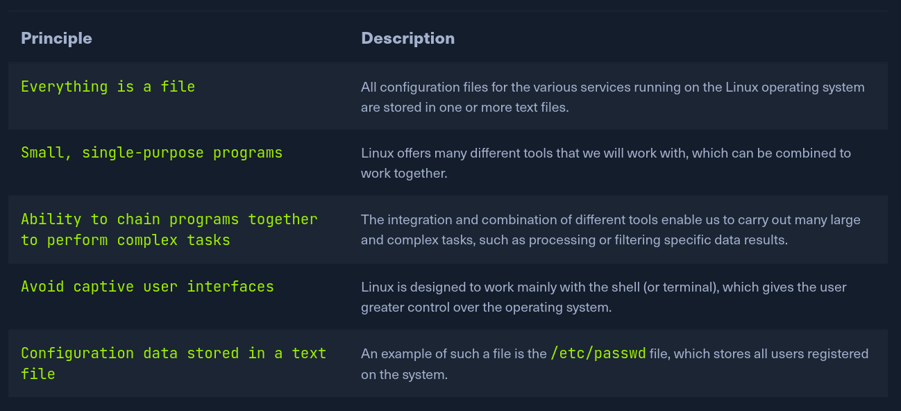

### Component

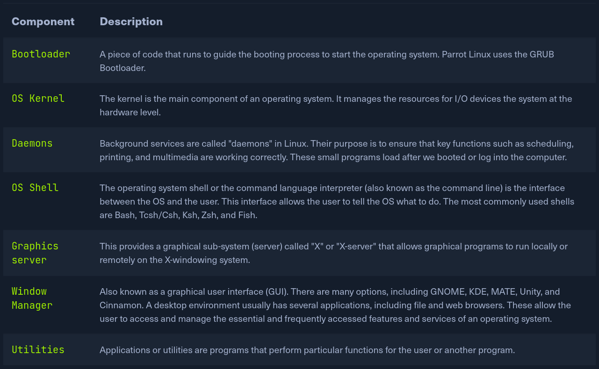

### Linux Architecture

The linux operating system can be broken down into layers:

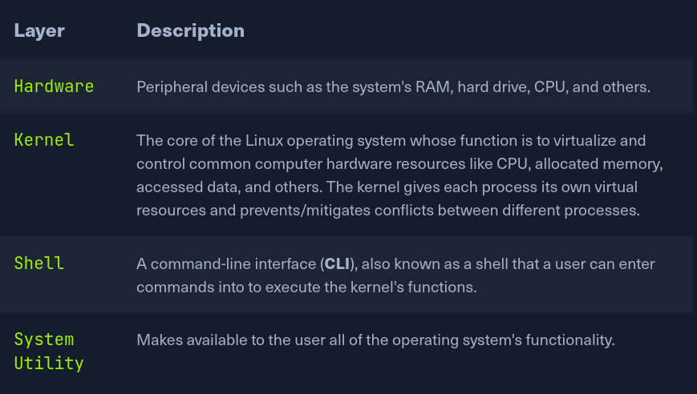

### File System Hierarchy

The Linux operating system is structures in a tree-like hierarchy and is documented in the **Filesystem Hierarchy** Standard(FHS). Linux is structured with the following standard top-level directories:

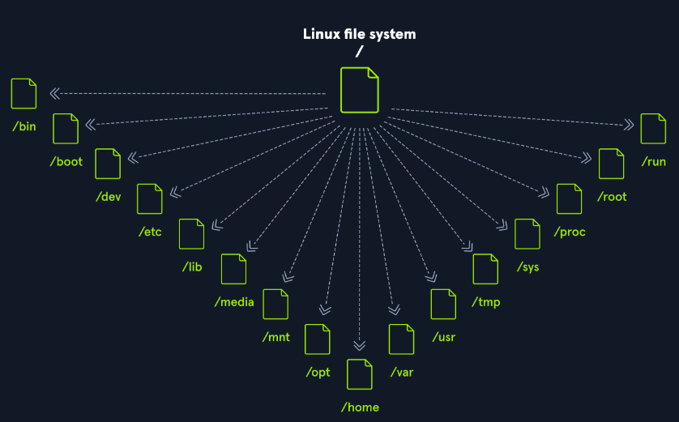

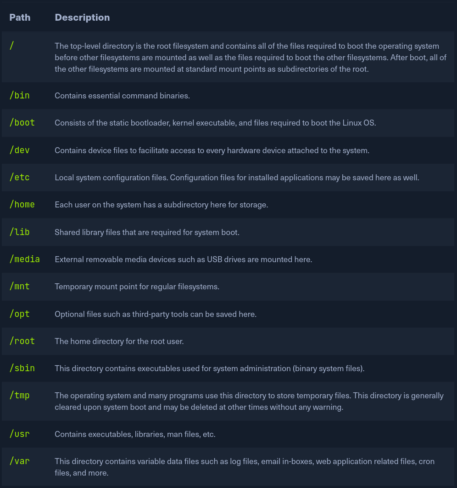

## <a name="d#introduction-to-the-shell">Introduction to the Shell</a>

### Shell

- A Linux terminal, also called a **shell** or commandline, provides a text-based input/output (I/O) interface between users and the kernel for a computer system. The term console is also typical but does not refer to a window but a screen in text mode. In the terminal window, commands can be executed to control the system.

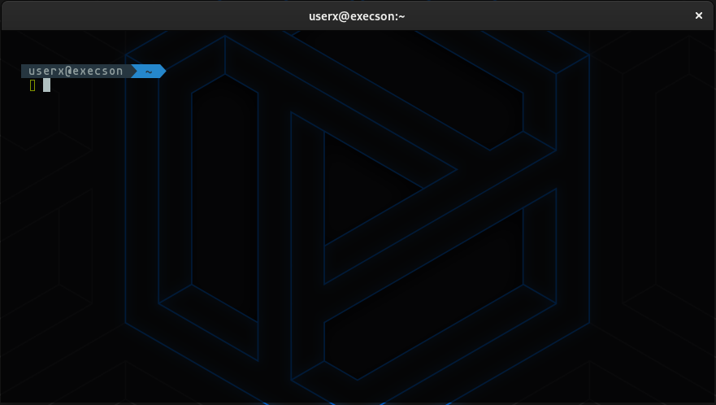

### Terminal Emulators

- Terminal emulators are often used for this. Terminal emulation is software that emulates the function of a terminal. It is used to be able to use text-based programs within a graphical user interface.

- Many different terminal emulators exist, such as **GNOME Terminal, Alacritty, rxvt, XTerm** and many more.

- There are also so-called command-line interfaces that run as additional terminals in one terminal and thus are **multiplexers**. These multiplexer include **Tmux, GNU Screen,** and others. In short, a terminal serves as an interface to the shell interpreter.

- Terminal emulators and multiplexers are beneficial extentions for the terminal. They provide us with different methods and functions to work with the terminal, such as splitting terminal in one window, working in multiple directories, creating different workspaces, and much more.

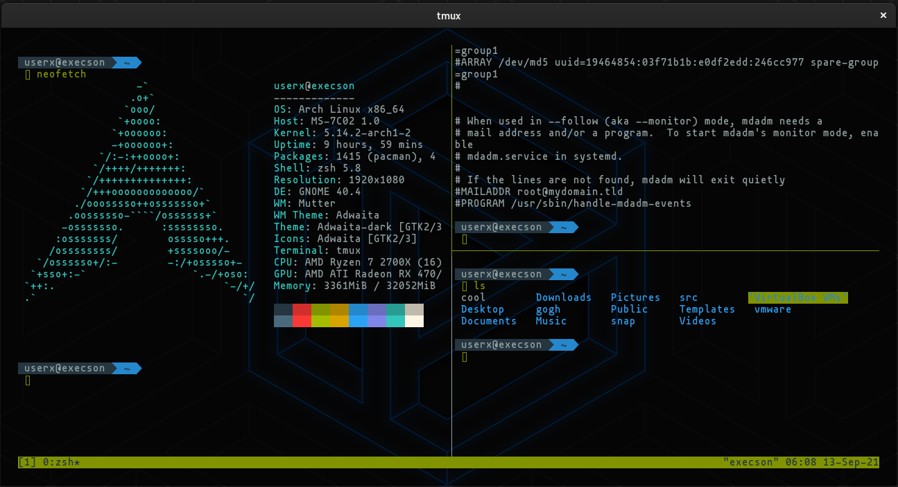

### Shell

- The most commonly used shell in Linux is the **Bourne-Again Shell (BASH)** and is part of the GNU project. Everything we do through the GUI we can do with the shell. The shell gives us many more possibilities to interact with programs and processes to get information faster.

- Besides, many processes can be easily automated with smaller or larger scripts that make manual work much easier.

- Like BASH, there are also some other shells like **Tcsh/Csh, Ksh, Zsh, Fish** shell, and others.

## <a name="#the-shell">The Shell</a>

### <a name="#prompt-description">Prompt Description</a>

- The bash prompt is easy to understand and, by default, includes information such as the user, hostname, and current working directory. The format can look something like this:

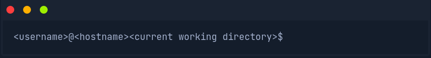

- The home directory for a user is marked with a tilde <**~**> and is the default folder when we log in.


- The dollar sign, in this case, stands for a user. As soon we log in as **root**, the character changes to a **hash** <**#**> looks like this:

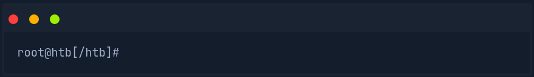

### <a name="">Getting Help

- The first two ways are the **man** pages and the **help** functions.

- In, the man pages, we will find the detailed manuals with detailed explanations.

```
user@hostname$ man <tool>
```

Let us have a look at an example:

**Example**

```
user@hostname$ man curl
```

After looking at some examples, we can also quickly look at the optional parameters without browsing through the complete documentation. We have several ways to do that.

**Syntax**

```
user@hostname$ curl --help
```
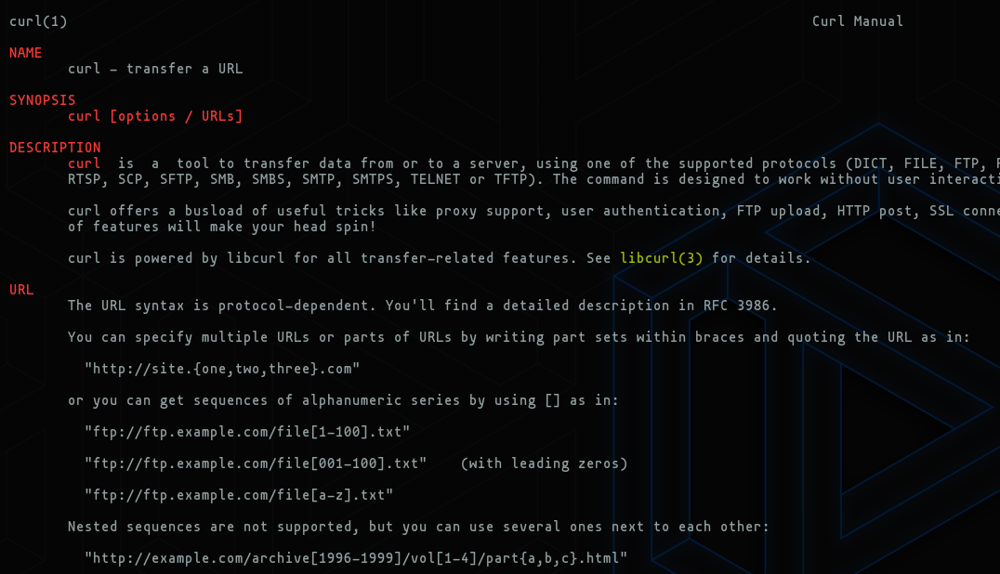

- Short version of help:

```
user@hostname$ -h
```
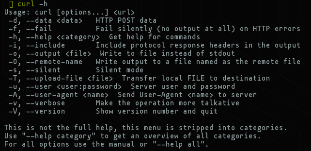

- Another tool that can be useful in the beginning is **appropos**.

**Syntax**

```
user@hostname$ apropos <keyword>
```

**Example**

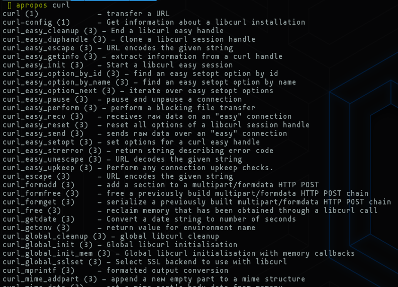

### <a href="#system-information">System Information</a>

| Command | Description 
|---------|-------------
| whoami | Display current username.
| id | Returns users identity
| hostname | Sets or prints the name of current host system.
| uname | Prints basic information about the operating system name and system hardware.
| pwd | Returns working directory name.
| ifconfig | The ifconfig utility is used to assign or to view an address to a network interface and/or configure network interface parameters.
| ip | Ip is a utility to show or manipulate routing, network devices, interfaces and tunnels.
| netstat | Shows network status.
| ss | Another utility to investigate sockets.
| ps | Shows process status.
| who | Displays who is logged in.
| env | Prints environment or sets and executes command.
| lsblk | Lists block devices.
| lsusb | Lists USB devices.
| lsof | List opened files.
| lspci | Lists PCI devices.

**Hostname**

The **hostname** command is pretty self-explanatory and will just prints the name of the computer that we are logged into

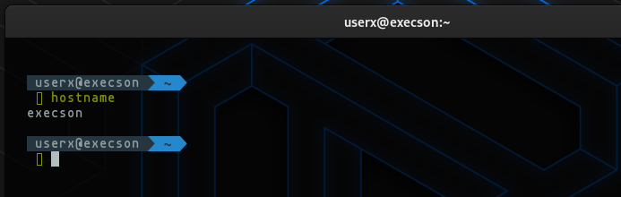

**Whoami**

- This quick and easy command can be used both on Windows and Linux systems to get our current username.

- During a security assesment, we obtain reverse shell access on a host, and one of the first bits of situational awareness we should do is figuring out what user we are running as.

- So that, we can figure out if the user has any special privileges/access.

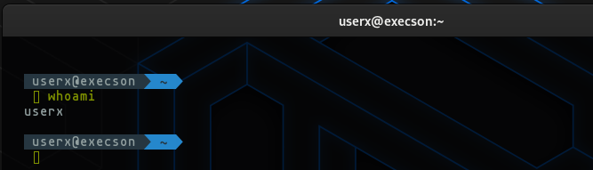

**Id**

- The **id** command expands on the **whoami** command and prints out our effective group membership and IDs. This can be of interest to penetration testers looking to see what access a user may have and sysadmins looking to audit account permissions and group membership.

- In this output, the **hackthebox** group is of interest because it is non-standard, the **adm** group means that the user can read log files in **/var/log** and could potentially gain access to sensitive information.

- Membership in the **sudo** group is of particular interest as this means our user can run some or all commands as the the powerful **root** user. Sudo rights could help us escalate privileges or could be a sysadmin that they may need to audit permissions and group memberships to remove any access that is not required for a given user to carry out their day-to-day tasks.

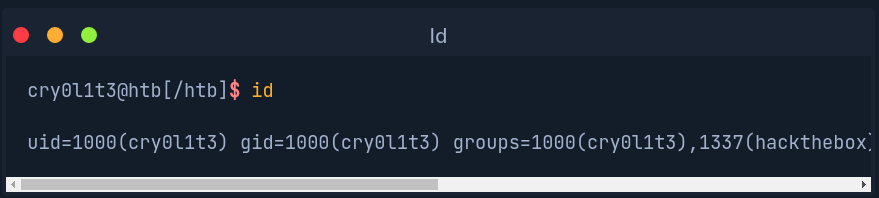

**Uname**

- Running **uname -a** will print all information about the machine in a specific order: kernel name, hostname, the kernel release, kernel version, machine hardware name, and operating system.

- The **-a** flag will omit **-p**(processor type) and **-i**(hardware platform) if they are unkown.

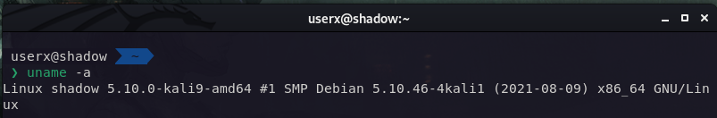

- From the above command, we can see that kernel name is **Linux**, the hostname is **shadow**, the kernel release is **#1 SMP Debian 5.10.46-4kali1 (2021-08-09)**, the kernel version is **5.10.0-kali9-amd64**, and so on.

**Uname to Obtain Kernel Release**

- type **uname -r** to obtain this information.

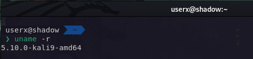

**Logging in via SSH**

- **Secure Shell(SSH)** refers to a protocol that allows client to access and execute commands or actions on remote computers.

- On linux-based hosts and servers running or another Unix-like operating system, SSH is one of the permanently installed standard tools and is the prefered choice for many administrations to configure and maintain a computer through remote access.

- It is an older and very proven protocol that does not require or offer a graphical user interface (GUI). For this reason, it works very efficiently and occupies very few resources.

- We can connect to our targets with the following command:

**SSH Login**
 
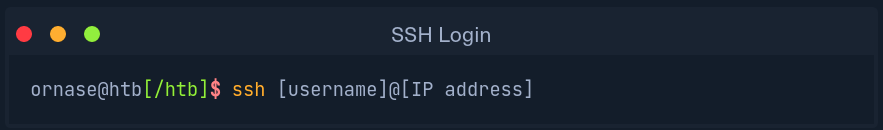

## <a name="#system-management">System Management</a>

### <a name="#user-management">User Management</a>

**Execution as a user**

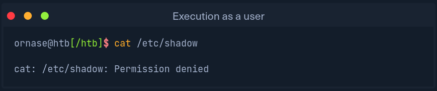

**Execution as a root**

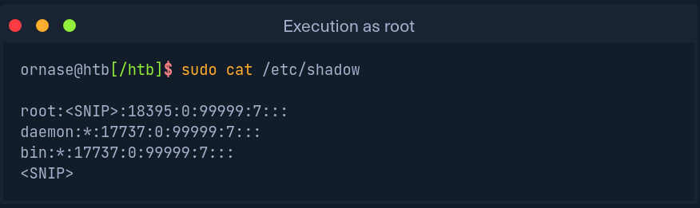

- Here is a list that will help us to better understand and deal with user management.

| Command | Description
|---------|------------
| sudo    | Execute command as a different user. 
| su      | The **su** utility requests appropriate user credential via PAM and switches to that user ID (the default user is the superuser). A shell is then executed. 
| useradd | Creates a new user or update default new user information. 
| userdel | Deletes a user account and related files. 
| usermod | Modifies a user account. 
| addgroup| Adds a group to the system. 
| delgroup| Removes a group from the system. 
| passwd  | Changes user password.

- User management is essential in any operating system, and the best way to become familiar with it is to try out the individual commands in conjunction with their various options.

### <a name="#package-management">Package Management</a>

- Packages are archives that contain binaries of software, configuration files, information about dependencies and keep track of updates and upgrades.

- The features that most package management systems provide are:
	- Package downloading
	- Dependency resolution
	- A standard binary package format
	- Common installation and configuration locations
	- Additional system-related configuration and functionality
	- Quality control

- The package management requirement is the software to be installed is available as a corresponding package.

- Typically this is created, offered, and maintained centrally under Linux distributions.

- In this way, the software is integrated directly into the system, and its various directories are distributed throughout the system.

- The package management software changes to the system to install the package are taken from the package and implemented by the package management software.

- If the package management software recognizes that additional packages are required for the proper functioning of the packages that has not yet been installed, a dependency is included and either warn the administrator or tries to reload the missing software from a repository, for example, and install it in advance.

- If an installed software has been deleted, the package management system then retakes the package's information, modifies it based on its configuration, and deletes files.

- There are different packages management programs that we can use for this. Here is a list of examples of such programs:

| Command | Description
|---------|------------
| **dpkg** | The **dpkg** is a tool to install, build, remove, and manage Debian packages. The primary and more user-friendly front-end for **dpkg** is aptitude.
| **apt** | Apt provides a high-level command-line interface for the package management system.
| **aptitude** | Aptitude is an alternative to apt and is a high-level interface to the package manager.
| **snap** | Install, configure, refresh, and remove snap packages. Snaps enable the secure distribution of the latest apps and utilities for the cloud, servers, desktops, and the internet of things.
| **gem** | Gem is the front-end to RubyGems, the standard package manager for Ruby.
| **pip** | Pip is a Python package installer recommended for installing Python packages that are not available in the Debian archive. It can work with version control repositories (currently on Git, Mercurial, and Bazaar repositories), logs output extentsively, and prevents partial installs by downloading all requirement before starting installation.
| **git** | Git is a fast, scalable, distributed revision control system with an usually rich command set that provides both high-level operations and full access to internals.

**Advaned Package Manager (APT)**

- Debian-based Linux distribution use that **APT** package manager. a package is an archive file containing multiple ".deb" files.

- The **dpkg** utility is used to install programs from the associated ".deb" files.

- **APT** makes updating and installing programs easier because many programs have dependencies. When installing a program from a standalone ".deb" file, we may run into dependency issues and need to download and install one or multiple additional packages.

- **APT** makes this easier and more efficient by packaging together all of the dependencies needed to install a program.

- Each linux distribution uses software repositories that are updated often When we update a program or install a new one, the system queries these repositories for the desired package.

- Repositories can be labeled as stable, testing, or unstable. Most Linux distributions utilize the most stable or "main" repository. This can be checked by viewing the content of the **/etc/apt/sources.list** file.

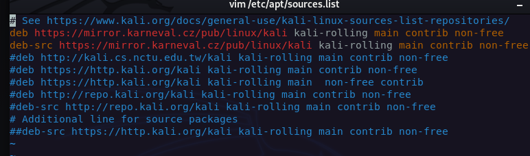

- APT uses a database called the APT cache. This is used to provide information about packages installed on our system offline. We can search the APT cache, for example, to find all **Impacket** related packages.

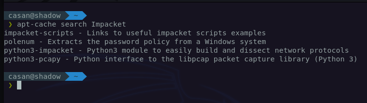

- Also we can view additional information about a package.

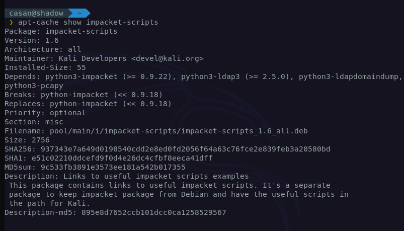

- We can also list all installed packages.

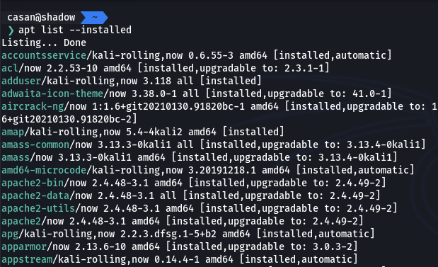

- If we are missing some packages, we can search for it and install it using the following command.

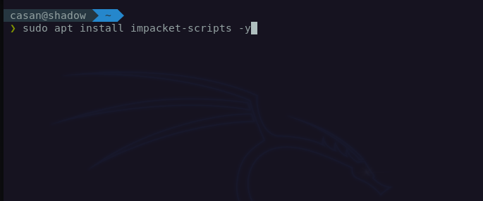

**GIT**

- Using github is a most convinient things for the hacker, you can download and use so many tools using this platform

- Cloning a sample Project for now named ***Nishang***.

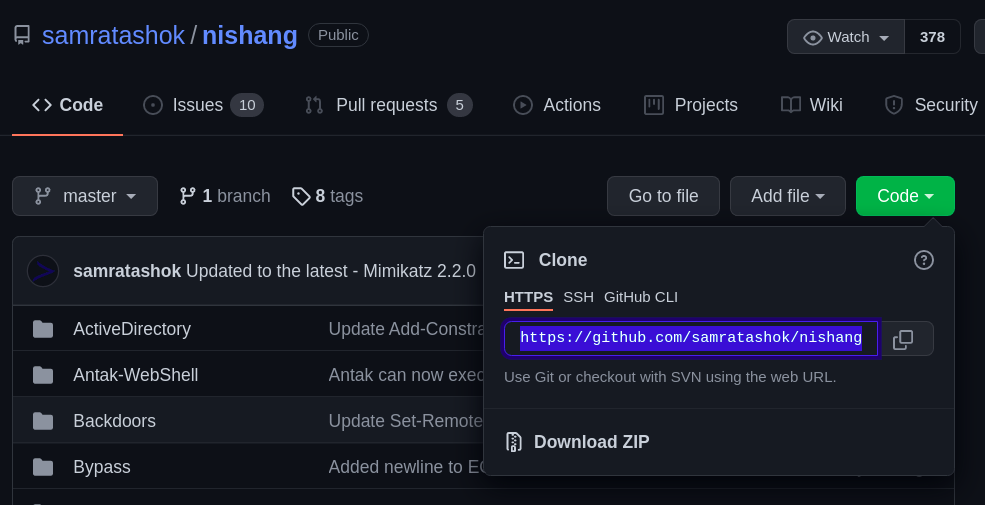

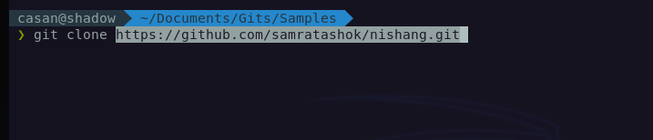

- After cloning the repository we need to navigate to the project Directory:

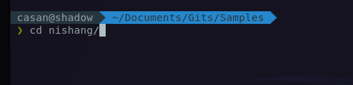

**DPKG**

- We can also download the programs and tools from the repositories separately. In this example,, we download 'strace' for Ubuntu 18.04 LTS.

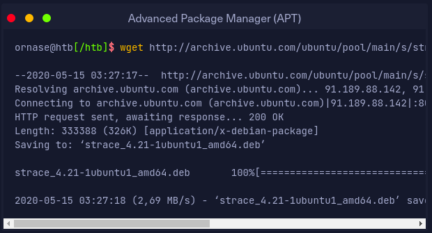

- Installing Application

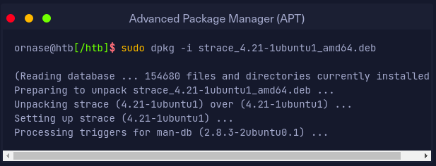

- Testing the application...

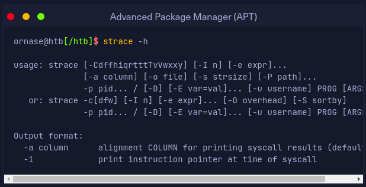

### <a name="#service-and-process-managemen">Service and Process Management</a>

- In general there are two types of services: internal, the relevant services that are required at system startup, which for example, perform hardware-related tasks, and services that are installed by the user, which usually include all server services.

- Such services run in the background without any user interaction. These are also called **daemons** and are identified by the letter **'d'** at the end of the program name, for example, **sshd** or **systemd**.

- Most Linux distribution have now switched to **systemd**. This daemon is an **Init process** started first and thus has the process ID (PID) 1. This daemon monitors and takes care of the orderly starting and stopping of other services.

- All processes have an assigned PID that can be viewed under **/proc/** with the corresponding number. Such a process can have a parent process ID (PPID), known as the child process.

- Besides **systemctl** we can also use **update-rc.d** to manage SysV init script links. Let us have a look at some examples. We will use the **OpenSSH** server in these examples. If we do not have this installed, please install it before proceeding to this section.

**Systemctl**

- After installing **OpenSSH** on our VM, we can start the service with the following command.

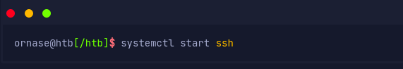

- After we have started the service, we can now check if it runs without errors.

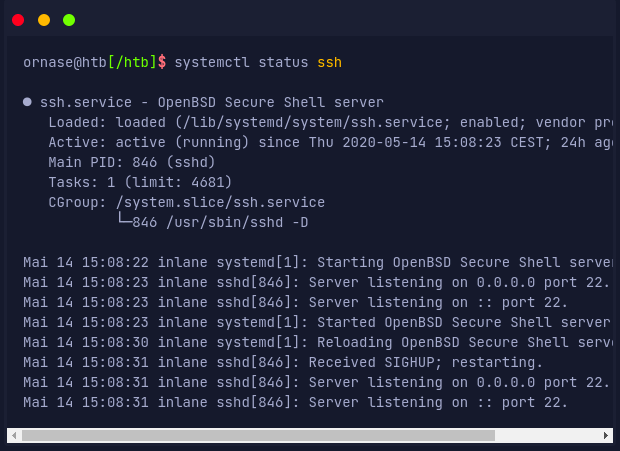

- To add OpenSSH to the SysV script to tell the system to run this service after startup, we can link it with the following command:

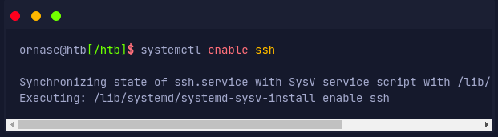

- Once we reboot the system, the OpenSSH server will automatically run. We can check this with a tool called **ps**.

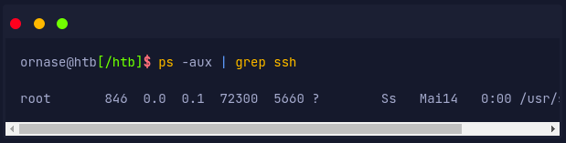

- We can also use **systemctl** to list all services.

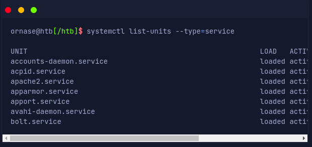

- Is is quite possible that the services do not start due to an error. To see the problem, we can use the tool **journalctl** to view the logs.


**Kill a Process**

- A process can be in the following states:
	- running
	- waiting (waiting for an event or system resource)
	- stopped
	- zombie (stopped but still has an entry in the process table).
- Processes can be controlled using **kill, pkill, pgrep,** and **killall**. To interact with a process, we must send a signal to it. We can view all signals with the following command:

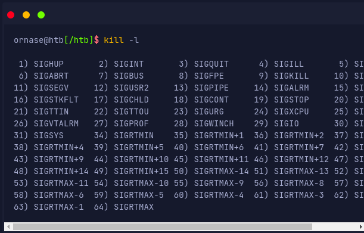

- The most commonly used are:

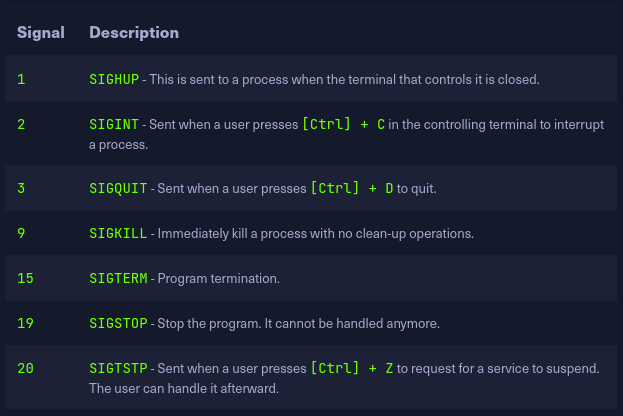

- For example, if a program were to freeze, we could force to kill it with the following command:

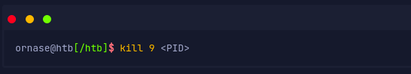

**Background a Process**

- Sometimes it will be necessary to put the scan or process we just started in the background to continue using the current session to interact with the system or start other process.

- As we have already seen, we can do this with the shortcut **[Ctrl + Z]**. As mentioned above, we send the **SIGTSTP** signal to the kernel, which suspends the process.

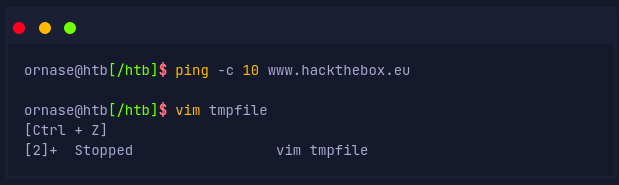

- Now all background processes can be displayed with the following command.

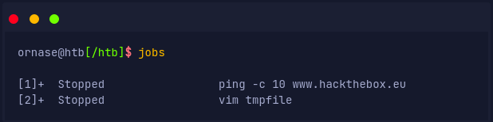

- The **[Ctrl] + Z** shortcut suspends the processes, and they will not be executed further. To keep it running in the background, we have to enter the command **bg** to put the process in the background.

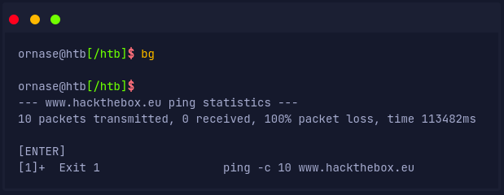

- Another option is to automatically set the process with an AND sign **(&)** at the end of the command.

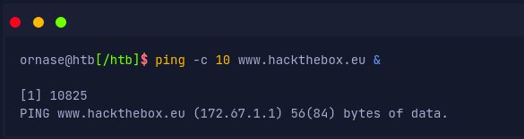

- Once the process finishes, we will see the results:

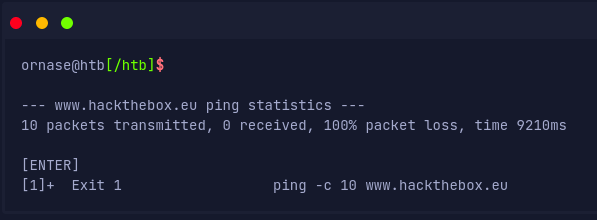

**Foreground a Process**

- We can use the **jobs** command to list all background processes.

- Background Processes do not require user interaction, and we can use the same shell session without waiting until the process finishes first.

- Once the scan or process finishes its work, we will get notified by the terminal that the process is finished.

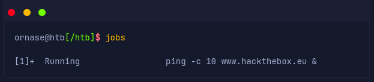

- If we want to get the background process into the foreground and interact with it again, we can use the **fg <ID>** command.

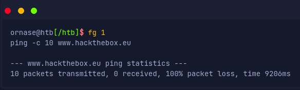

**Execute Multiple Commands**

- There are three possibilities to run commands, one after the other. These are separated by:

	- Semicolon (**;**)
	- Double **ampersand** characters (**&&**)
	- Pipes (**|**)

- The difference between them lies in the previous processes treatment and depends on whether the previous process was completed successfull or with errors.

- The semicolon (**;**) is a command separater and executes the commands by ignoring previous commands results and errors.

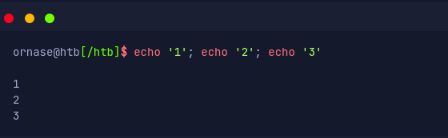

- For example, if we execute the same command but replace it in second place, the command **ls** with a file that does not exist, we get an error, and the third command will be executed nevertheless.

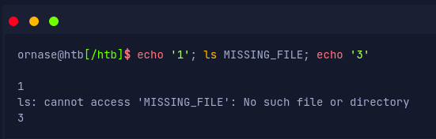

- However, it looks different if we use the double AND characters (**&&**) to run the commands one after the other. If there is an error in one of the commands, the following ones will not be executed anymore, and the whole process will be stopped.

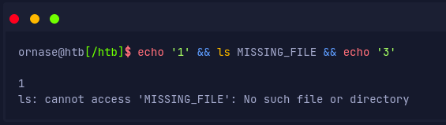

- Pipes (**|**) depend not only on the correct and error-free operation of the previous processes but also on the previous processes results.

### <a name="#working-with-web-services">Working with Web Services</a>

- Another essential component is the communication with the web servers. There are many different ways to set up web servers on Linux operating systems.

- One of the most used and widespread web servers, besides IIS and Nginx, is Apache. For an Apache web server, we can use appropriate modules, which can encrypt the communication between browser and web server (mod_ssl), use as a proxy server (mod_proxy), or perform complex manipulations of HTTP header data (mod_headers) and URLs (mod_rewrite).

- Apache offers the possibility to create web pages dynamically using server-side scripting languages.

- Commonly used scripting languages are PHP, Perl, or Ruby.

- Other languages are Python, Javascript, Lua, and .Net, which can be used for this. We can install the Apache webserver with the following command.

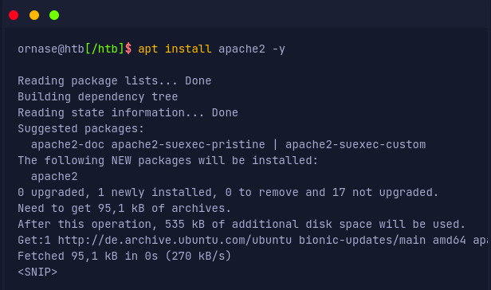

- For starting apache2 service

```
$ sudo service apache2 start
```

- After starting it, we can navigate using our web-browser to the default page (http://localhost)

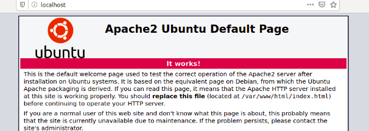

- In the above, the image showing the default page of **apache2** and serves to confirm that the webserver is working correctly.

**CURL**

- **cURL** is a tool that allows us to transfer files from the shell over protocols like **HTTP,HTTPS,FTP,SFTP,FTPS,**or**SCP**. This tool gives us the possibility to control and test websites remotely.

- Besides the remote servers' content, we can also view individual requests to look at the client's and server's communication.

- Usually, **cURL** is already installed on most Linux systems. This is another critical reason to familiarize ourselves with this tool, as it can make some processes much easier later on.

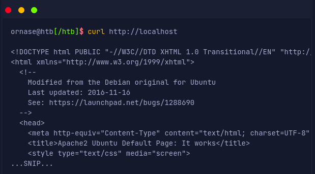

- In the title tag, we can see that it is the same text as from our browser. This allows us to inspect the source code of the website and get information from it.


**Wget**

- An alternative to curl is the tool **wget**. With this tool, we can download files from FTP or HTTP servers directly from the terminal and serves as a good download manager.

- If we use wget in the same way, the difference to curl is that the website content is downloaded and stored locally, as shown in the following example.

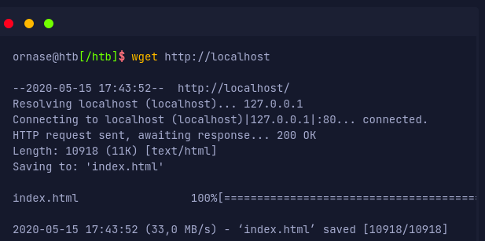

**Python3**

- Another option that is often used when it comes to data transfer is the use of Python3. In this case, the web server's root directory is where the command is executed to start the server.

- For this example, we are in a directory where WordPress is installed and contains a "reade.html". Now, let us start the Python3 web server and see if we can access it using the browser.

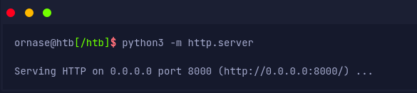


- We can see what request were made it we now look at our Python3 web server's events

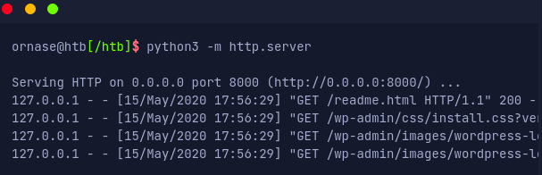

## <a name="#workflow">Workflow</a>

### <a name="#navigation">Navigation</a>

- Here we cover the sections on how to navigate through Linux, **create, move, edit and delete files and folders, find them on the operating system, different types of redirects, and what file descriptors are.**

- Then we will find some shortcuts that will make our work with the shell easier.

- Let us start with the navigation. Before we move through the system, we have to find out in which directory we are. We can find out where we are with the command **pwd**.

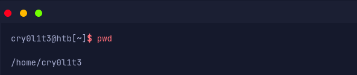

- Only the **ls** command is needed for navigation. It has many additional options that can complement the display of the content in the current folder.

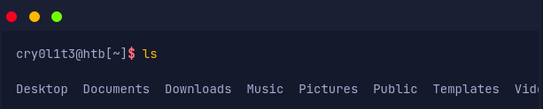

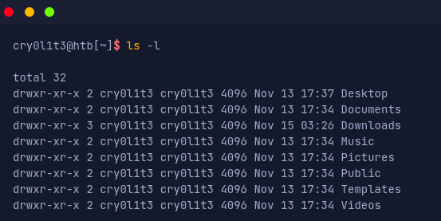

- However, we will not see everything that is in this folder. To list the content of a directory, we do not necessarily need to navigate there first. We can also use "**ls**" to specify the path where we want to know the contents.

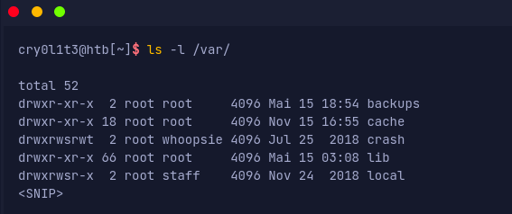

- We can do the same thing if we want to navigate to the directory. To move through the directories, we can use the command **cd**.

- To move through the directories, we use the command **cd**. Let us change to the **/dev/shm** directory.

- We can also go to the **/dev** directory first and then **/shm**. Nevertheless, we can also directly enter the full path and jump directly there.

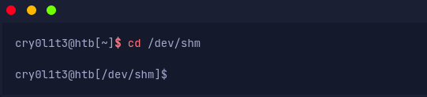

- Since we were in the home directory before, we can quickly jump back to the directory we were last in.

- The shell also offers us the auto-complete function, which makes navigation easier. If we now type **cd /dev/s** and then press **[TAB] twice**, we will get all entries starting with the letter "**s**" in the directory of **/dev/**.

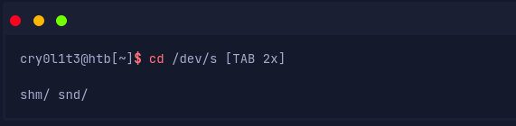

- If we add the letter "**h**" to the letter "**s**", the shell will complete the input since otherwise there will be no folders in this directory begining with the letters "**sh**".

- If we now display all contents of the directory, we will only see the following contents.

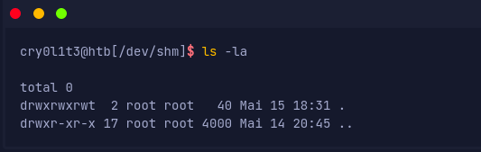

- The first entry with a single dot (**.**) indicate the current directory we are currently in.

- The second entry with two dots (**..**) represents the parent directory **/dev**. This means that we can jump to the parent directory with the following command:

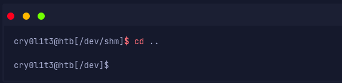

- Since our shell is filled with some records, we can clean the shell with the command **clear**. However, let us return to the directory **/dev/shm** before.

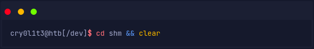

### <a name="#working-with-files-and-directories">Working with Files and Directories</a>

**Create, Move, and Copy**

- First, let us create an empty file and a directory. We can use **touch** to create an empty file and **mkdir** to create a directory.

- The syntax for this is the following:

**Syntax - touch**

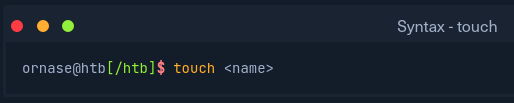

**Syntax - mkdir**

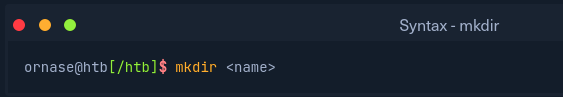

- In this example, we name the file **info.txt** and the directory **Storage**. To create these, we follow the commands and their syntax shown above.

**Create an Empty File**

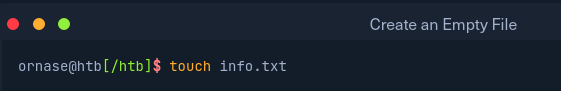

**Create a Directory**

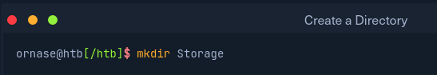

- The command **mkdir** has an option marked **-p** to add parent directories.

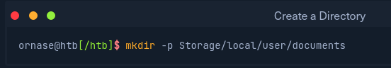

- We can look at the whole structure after creating the parent directories with the tool **tree**.

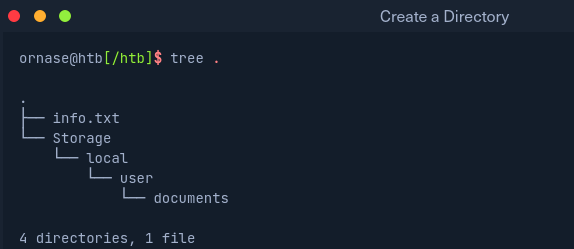

- We can also create files directly in the directories by specifying the path where the files should be stored. The trick is to use the single dot (.) to tell the system that we want to start from the current directory. So the command for creating another empty file looks like this.

**Create userinfo.txt**

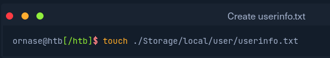

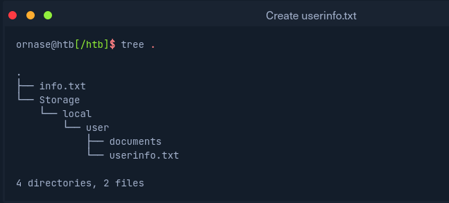

- With the command **mv**, we can move and also rename files and directories. The syntax for this looks like this:

**Syntax - mv**

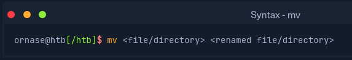

- First, let us rename the file **info.txt** to **information.txt** and then move it to the directory **Storage**.

**Rename File**

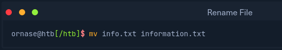

- Now let us create a file named **readme.txt** in the current directory and then copy the files **information.txt** and **readme.txt** into the **Storage/** directory.

**Create readme.txt**

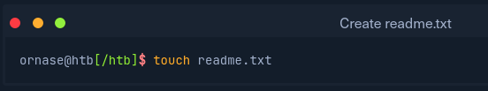


- Let us assume we want to have the **readme.txt** in the **local** directory. Then we can copy them there with the paths specified.

**Copy readme.txt**

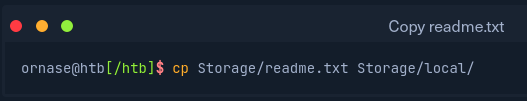

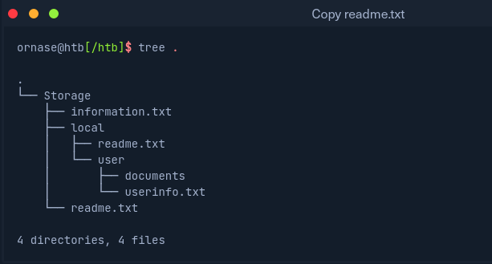

### <a name="#editing-files">Editing Files</a>

- We will first deal with the Nano editor here, as it is a bit easier to understand. We can create a new file directory with the Nano editor by specifying the file's name directory as the first parameter. In this case, we create a new file named **notes.txt**.

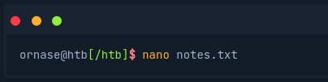

- Now we should see a so-called "**pager**" open, and we can freely enter or insert and text. Our shell should then look something like this.

**Nano Editor**

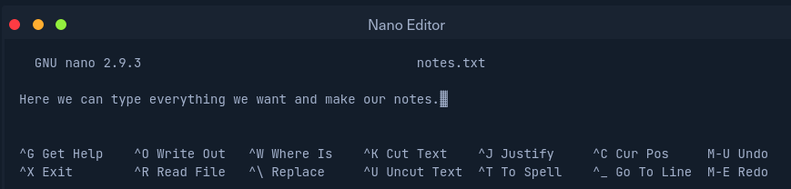

- Below we see two lines with short descriptions. The **caret** (**^**) stands for our "**[CTRL]**" key. For example, if we press **[Ctrl+W]**, a "**Search:**" line appears at the bottom of the editor, where we can enter the word or words we are looking for. If we are now search for the word "**we**" and press **[ENTER]**, the cursor will move to the first word that matches.


- To jump to the next match with the cursor, we press **[Ctrl + W]** again and confirm with **[ENTER]** without any additional information.

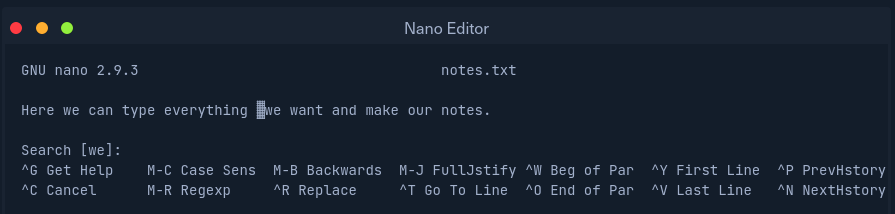

- After we have saved the file, we can leave the editor with **[CTRL + X]**.

**Back on the Shell**

- To view the contents of the file, we can use the command **cat**.

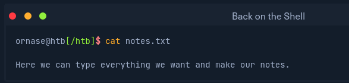

- There are many files on Linux systems that can play an essential role for us as penetration testers whose rights have not been correctly set by the administrators. Such files may include the file "**/etc/passwd**".

**VIM**

- **Vim** is an open-source editor for all kinds of ASCII text, just like Nano. It is an improved clone of the previous Vi.

- Is is an extremely powerful editor that focuses on the essentials, namely editing text. For tasks that go beyond that, Vim provides an interface to external programs, such as **grep, awk, sed,** etc., which can handle their specific taks much better than a corresponding function directly implemented in an editor usually can.

- This makes the editor small and compact, fast, powerful, flexible, and less error-prone.

- Vim follows the Unix principle here: many small specialized programs that are well tested and proven, when combined and communicating with each other, resulting in a flexible and powerful system.

**Vim**

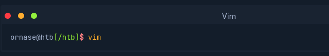

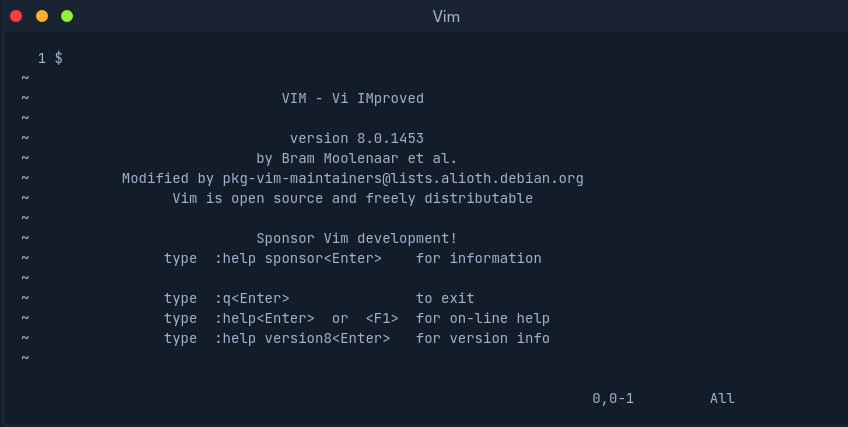

- In contrast to Nano, **Vim** is a model editor that can distinguish between text and command input. Vim offers a total of six fundamental modes that make our work easier and make this editor so powerful:

| **Mode** | **Description**
|----------|----------------
| **Normal** | In normal mode, all input are considered as editor commands. So, there is no insertion of the entered character into the editor buffer, as is the case with most other editors. After starting the editor, we are usually in the normal mode.
| **Insert** | With a few exeptions, all entered characters are inserted into the buffer.
| **Visual** | The visual mode is used to mark a contiguous part of the text, which will be visually highlighted. By positioning the cursor, we change the selected area. The highlighted area can then be edited in various ways, such as deleting, copying, or replacing it.
| **Command** | It allows us to enter single-line commands at the bottom of the editor. This can be used for sorting, replacing text sections, or deleting them, for example.
| **Replace** | In replace mode, the newly entered text will overwrite existing text character unless there are no more old characters at the current cursor position. Then the newly entered text will be added.

- When we have the Vim editor open, we can go into command mode by typing "**:**" and then typing "**q**" to close Vim.

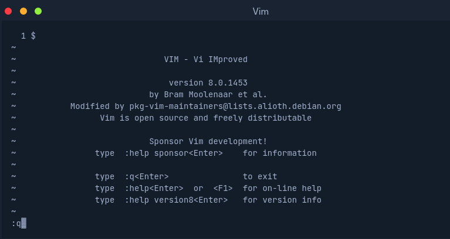

- Vim offers an excellent opportunity call **vimtutor** to practice and get familiar with the editor. It may seem very difficult and complicated at first, but it will only feel that way for a short time.

- The efficiency we gain from Vim once we get used to it is enormous.

**VimTutor**

[VimTutor](Images/VimTutor.png)

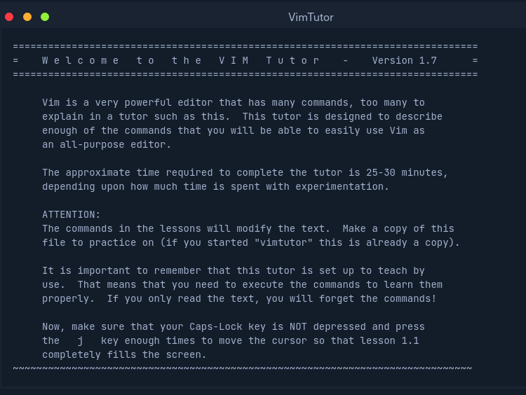

### <a name="#find-filea-and-directories">Find Files and Directories</a>

**Which**

- One of the common tools is **which**. This tool returns the path to the file or link that should be executed. This allows us to determine if specific programs, like **cURL, netcat, wget, python, gcc,** are available on the operating system. Let us use it to search for Python in our interactive instance.

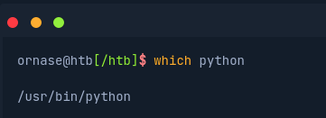

- If the program we search for does not exist, no results will be displayed.

**Find**

- Another handy tool is **find**. Besides the function to find files and folders, this tool also contains the function to filter the result. We can use filter parameter like the size of the file or the date.

- We can also specify if we only serach for files or folders.

**Syntax-find**

- An example of what such a command with multiple options would look like.

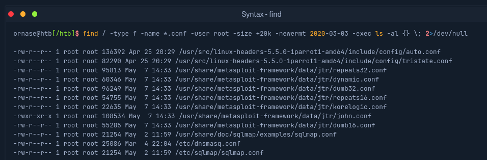

- Now let us take a closer look at the options we used in the previous command. If we hover the mouse over the respective options, a small window will appear with an explanation.

- These explanations will also be found in other modules, which should help us if are not yet familiar with one of the tools.

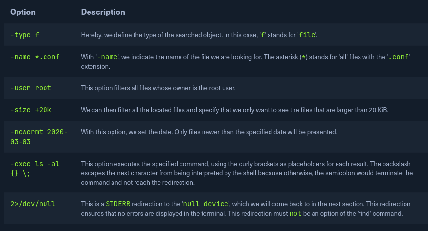

**Locate**

- The command **locate** offers us a quicker way to search through the system. In contrast to the **find** command, **locate** works with a local database that contain all information about existing files and folders. We can update this database with the following command.

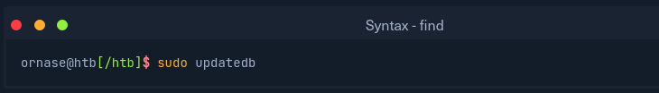

- If we now search for all files with the "**.conf**" extension, you will find that this search produces results much faster than using **find**.

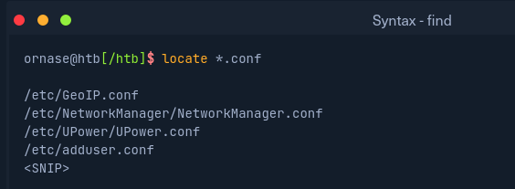

- However, this tool does not have as many filter options that we can use. So it is always worth considering whether we can use the **locate** command or instead use the **find** command. It always depends on what we are looking for.

### <a name="#file-descriptors-and-redirection">File Descriptors and Redirections</a>

**File Descriptors**

- A file descriptor (FD) in Unix/Linux operating systems is an indicator of connection maintained by the kernel to perform Input/Output(I/O) operations. In Windows-based operating systems, it is called filehandle.

- It is the connection (generally to a file) from the Operating sytem to perform I/O operations (Input/Output of Bytes). By default, the first three file descriptors in Linux are:

1. Data Stream for Input
	- STDIN - 0
2. Data Stream for Output
	- STDOUT - 1
3. Data Stream for Output that related to an error occuring.
	- STDERR - 2

**STDIN and STDOUT**

- Let us see an example with **cat**. When running **cat**, we give the running program our standard input (**STDIN -FD 0**), marked **green**, wherein this case "SOME INPUT" is. As soon as we have confirmed our input with **[ENTER]**, it is returned to the terminal as standard output (**STDOUT - FD 1**), marked **red**.

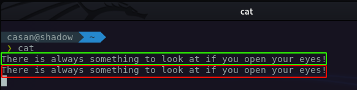

**STDOUT and STDERR**

- In the next example, by using the **find** command, we will see the standard output (**STDIN -FD 1**) marked in **green** and standard error (**STDERR - FD 2**) marked in red.

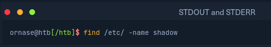

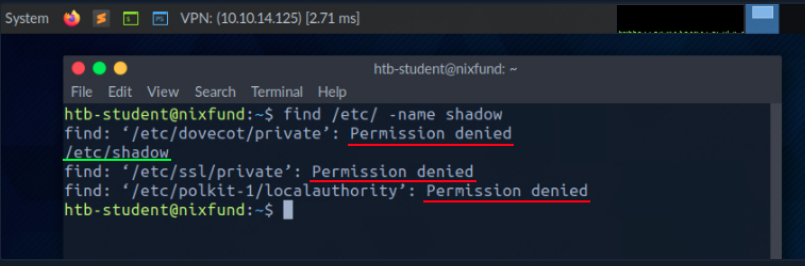

- In this case, the error is marked and displayed with "**Permission denied**". We can check this by redirecting the file descriptors for the errors (**FD 2 - STDERR**) to "**/dev/null**". This way, we redirect the resulting errors to the "null device", which descards all data.

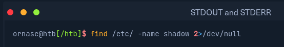

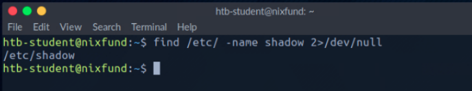

**Redirect STDOUT to a File**

- Now we can see that all errors (**STDERR**) previously presented with "**Permission denied**" are no longer displayed. The only result we see now is the standard output (**STDOUT**), which we can also redirect to a file with the name **result.txt** that will only contain standard output without the standard errors.

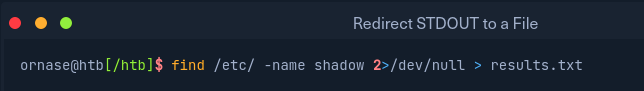

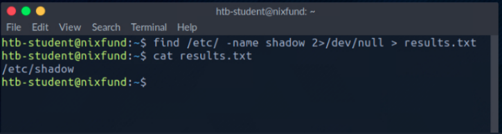

**Redirect STDOUT and STDERR to Separate Files**

- We should have noticed that we did not use a number before the greater-than sign (**<**) in the last example. That is because we redirected all the standard errors to the "**null device**" before, and the only output we get is the standard output (**FD 1 - STDOUT**). To make this more precise, we will redirect standard error (**FD 2 - STDERR**) and standard output (**FD 1 - STDOUT**) to different files.

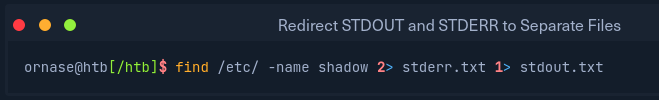

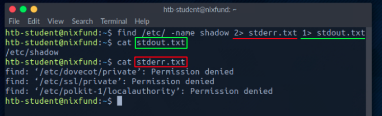

**Redirect STDIN**

- As we have already seen, in combination with the file descriptors, we can redirect errors and output with greate-than character (**>**). This also works with the lower-than sign (**<**).

- However, the lower-than sign serves as standard input (**FD 0 - STDIN**). These characters can be seen as "**direction**" in the form of an arrow that tells us "**from where**" and "**where to**" the data should be redirected. We use the **cat** command to use the contents of the file "**stdout.txt**" as **STDIN**.

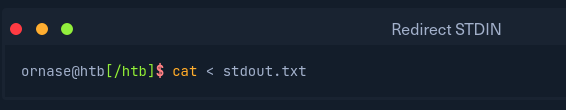

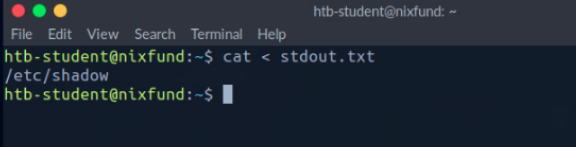

**Redirect STDOUT and Append to a File**

- When we use the greater-than sign (**>**) to redirect our **STDOUT**, a new file is automatically created if it does not already exist. If this file exists, it will be overwritten without asking for confirmation.

- If we want to append **STDOUT** to our existing file, we can use the double greater-than sign (**>>**).

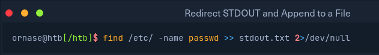

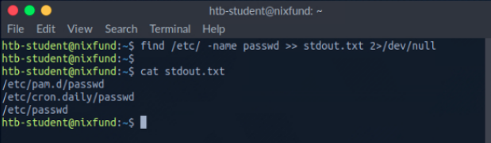

**Redirect STDIN Stream to a File**

- We can also use the double lower-than character (**<<**) to add out standard input through a stream.

- We can also use the so-called **End-Of-file (EOF)** function of a Linux system file, which defines the input's end. 

- In the next example, we will use the **cat** command to read our streaming input through the stream and direct it to file called "**stream.txt**".

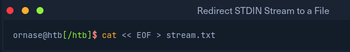

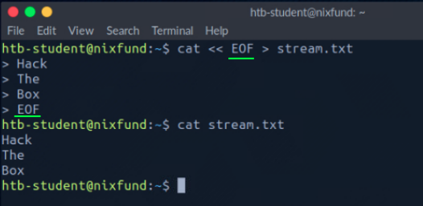

**Pipes**

- Another way to redirect **STDOUT** is to use pipes (**|**). These are useful when we want to use the **STDOUT** from one program to be processed by another.

- One of the most commonly used tools is **grep**, which we will use in the next example. Grep is used to filter **STDOUT** according to the pattern we define.

- Grep is used to filter **STDOUT** according to the pattern we define. In the next example, we use the **find** command to search for all files in the "**/etc**" directory with a "**.conf**" extension.

- Any errors are redirected the the "**null device**" (**/dev/null**). Using **grep**, we filter out the results and specify that only the lines containing the pattern "**systemd**" should be displayed.

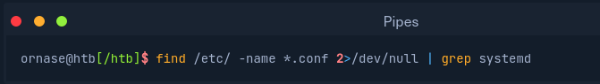

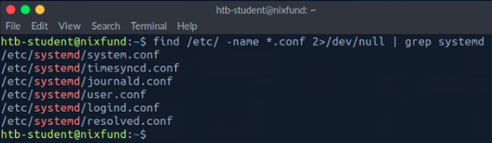

- The redirections work, not only once. We can use the obtained results to redirect them to another program. For the next example, we will use the tool called **wc**, which should count the total number of obtained results.

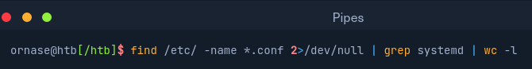

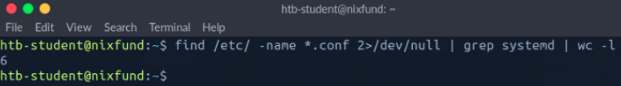

### <a name="#filter-contents">Filter Contents</a>

- In the last section, we learned about the redirections we can use to redirect results from one program to another for processing. To read files, we do not necessarily have to use an editor for that.

- There are two tools called **more** and **less**, which are very identical. These are fundamental **pager** that allow us to scroll through the file in an interactive view. Let us have a look at some examples.

**More**

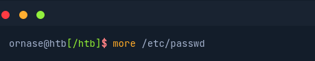

- After we read the content using **cat** and redirected it to **more**, the already mentioned **pager** opens, and we will automatically start at the beginning of the file.

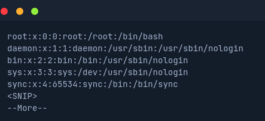

- With the **[Q]**, we can leave this **pager**. We will notice that the output remains in the terminal.

**Less**

- If we now take a look at the tool **less**, we will notice on the man page that it contains many more features than **more**

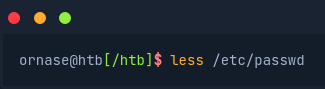

- The presentation is almost the same as with **more**.

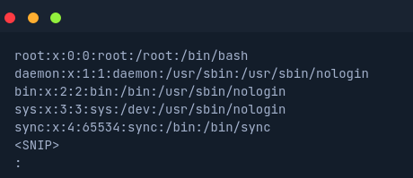

- When closing **less** with the **[Q]** key, we will notice that the output we have seen, unlike **more**, does not remain in the terminal

**Head**

- Sometimes we will only be interested in specific issues either at the beginning of the file or the end. If we only want to get the **first** lines of the file, we can use the tool **head**. By default, **head** prints the first ten lines of the given file or input, if not specified otherwise.

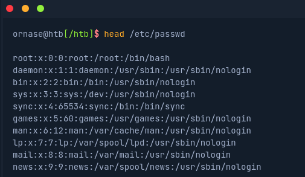

**Tail**

- If we only want to see the last parts of a file or results, we can use the counterpart of **head** called **tail**, which returns the **last** ten lines.

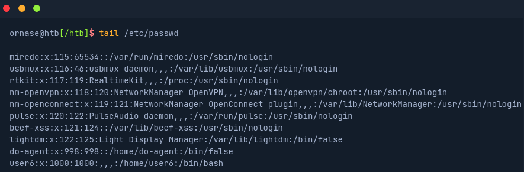

**Sort**

- Depending on which results and files are dealt with, they are rarely sorted. Often it is necessary to sort the desired results alphabetically or numerically to get a better overview. For this, we can use a tool called **sort**

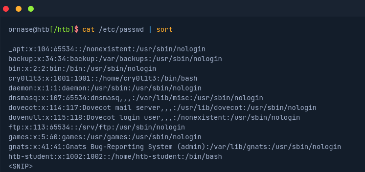

- As we can see how, the output no longer starts with root but is now sorted alphabetically.

**Grep**

- More often, we will only search for specified results that contain patterns we have defined. One of the most used tools for this is **grep**, which offers many different features.

- Accordingly, we can search for users who have the defaults shell "**/bin/bash**" set as an example.

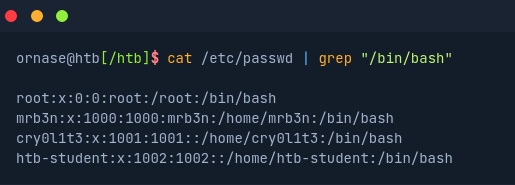

- Another possibility is to exclude specific results. For this, the options "**-v**" is used with **grep**. In the next example, we exclude all users who have disabled the standard shell with the name "**/bin/false**" or "**/usr/bin/login**".

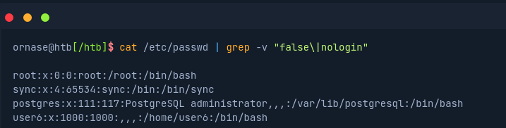

**Cut**

- Specific results with different characters may be separated as delimeters. Here it is handy to know how to remove specific delimeters and show the words on a line in a specified position.

- One of the tools that can be used for this is **cut**. Therefore we use the option "**-d**" and set the delimeter to the colon character (**:**) and define with the option "**-f**" the position in the line we want to output.

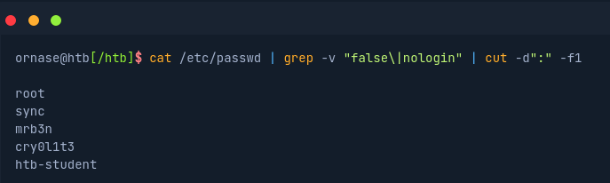

**Tr**

- Another possibility to replace certain characters from a line with characters defined by us is th tool **tr**. As the first options, we define which character we want to replace, and as a second option, we define the character we want to replace it with. In the next example, we replace the colon character with space.

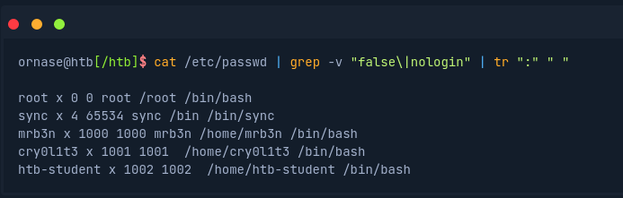

**Column**

- Since such result can often have an unclear representation, the tool **column** is well suited to display such results in tabular for using the **-t**.

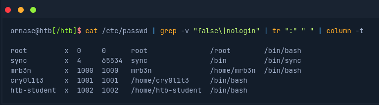

**Awk**

- As we may have noticed, the user "**postgres**" has one row too many. To keep it as simple as possible to sort out such results, the (**g**)**awk** programming is beneficial, which allows us to display the first (**$1**) and last (**$NF**) result of the line.

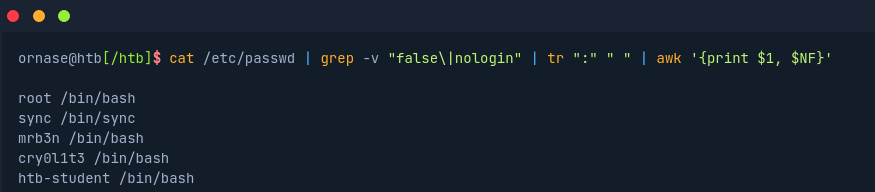

**Sed**

- There will come moments when we want to change specific names in the whole file or standard input. One of the tools we can use for this is the stream editor called **sed**. One of the most common uses of this is substituting text.

- Here, **sed** looks for patterns we have defined in the form of regular expressions (regex) and replaces them with another pattern that we have also defined. Let us stick to the last results and say we want to replace the word "**bin**" with "**HTB**".

- The "**s**" flag at the beginning stands for the substitute command. Then we specify the pattern we want to replace. After the slash (**/**), we enter the pattern we want to use as a replacement in the third position. Finally, we use the "**g**" flag, which stands for replacing all matches.


**Wc**

- Last but not least, it will often be useful to know how many successful matches we have. To avoid counting the lines or characters manually, we can use the tool **wc**. With the "**-l**" option, we specify that only the lines are counted.

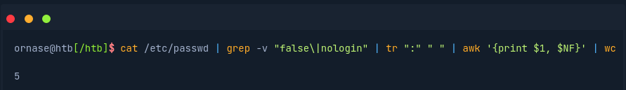

### <a name="#permission-management">Permission Management</a>

**Overview**

- Under Linux, permissions are assigned to users and groups. Each user can be a member of different groups, and membership in these groups gives the user specific, additional permissions.

- Each file and directory belongs to a specific user and a specific group. So the permissions for users and groups that defined a file are also defined for the respective owners.

- When we create new files or directories, they belongs to the groups we belong to and us. The whole permission system on Linux systems is based on the octal number system, and basically, there are three different types of permissions a file or directory can be assigned:
	- (**r**) - Read
	- (**w**) - write
	- (**x**) - Execute

- The permissions can be set for the **owner**, **groups**, and **others** like presented in the next example with their corresponding permissions.

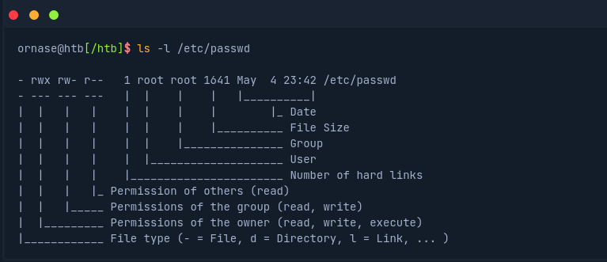

**Change Permissions**

- We can modify permissions using the **chmod** command, permission group references (**u** - owner, **g** - Group, **o** - others, **a** - All users), and either a [**+**] or a [**-**] to add remove the designated permissions. In the following example, a user creates a new shell script owned by that user, not executable, and set with read/write permissions for all users.

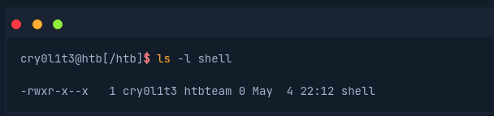

- We can then apply **read** permissions for all users and see the result.

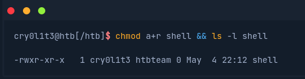

- We can also set the permissions for all other users to **read** only using the octal value assignment.

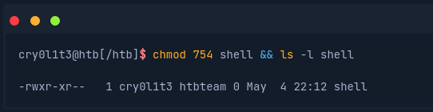

- Let us look at all the representation associated with it to understand better how the permission assignment is calculated.

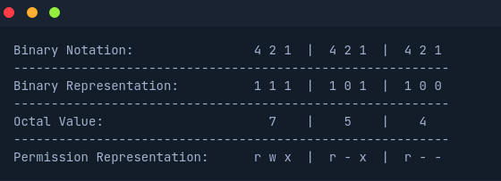

- If we sum the set bits from the **Binary Representation** assigned to the values from **Binary Notation** together, we get the **Octal Value**. The **Permission Representation** represents the bits set in the **Binary Representation** by using the three characters, which only recognizes the set permissions easier.

**Change Owner**

- To change the owner and/or the group assignment of a file or directory, we can use the **chown** command. The syntax is like following:

**Syntax - chown**

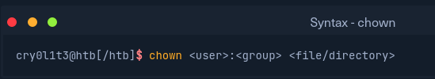

In this example, "shell" can be replaced with any arbitrary file or folder.

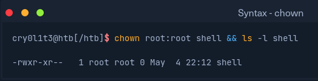

**SUID & GUID**

- Besides assigning direct user and group permissions, we can also configure special permissions for file by setting the **Set User ID (SUID)** and **Set Group ID(GUID)** bits. These **SUID/GUID** bits allow, for example, users to run programs with the rights of another user.

- Administrators often use this to give their users special rights for certain applications of files. The letter "**s**" is used instead of an "**x**". When executing such a program, the SUID/GUID of the file owner is used.

- It is often the case that administrators are not familiar with the applications but still assign the SUID/GUID bits, which leads to a high-security risk. Such programs may contain functions that allow the execution of a shell from the pager, such as the application "**journalctl**".

- If the administrator sets the SUID bit to "**journalctl**", any user with access to this application could excute a shell as **root**.

### <a name="#shortcuts">Shortcuts</a>

**Auto-Complete**

- **[TAB]** - Initiate auto-complete. This will suggest to us different options based on the **STDIN** we provide. These can be specific suggestions like directories in our current working evironment, commands starting with the same number of characters we already typed, or options.

**Cursor Movement**

**[CTRL] + A** - Move the cursor to the **beginning** of the current line.
**[CTRL] + E** - Move the cursor to the **end** of the current line.
**[CTRL] + [<-]/[->]** - Jump at the beginning of the current/previous word.
**[ALT] + B / F** - Jump backward/forward one word.

**Erase The Current Line**

**[CTRL] + U** - Erase everything from the current position of the cursor to the **beginning** of the line.
**[CTRL] + K** - Erase everything from the current position of the cursor to the **end** of the line.
**[CTRL] + W** - Erase the word preceding the cursor position.

**Paste Erased Contents**

**[Crtl] + Y** - Pastes the erased text or word.

**Ends Task**

**[CTRL] + C** - Ends the current task/process by sending the **SIGINT** signal. For example, this can be a scan that is running by a tool. If we are watching the scan, we can stop it / kill this process by using this shortcut.

- While not configured and developed by the tool we using. The process will be killed asking us for confirmation.

**End-of-File (EOF)**

**[CTRL] + D** - Close **STDIN** pipe that is also known as End-of-File (EOF) or End-of-Transmission.

**Clear Terminal**

**[CTRL] + L** - Clears the terminal. An alternative to this shortcut is the **clear** command you can type clear our terminal.

**Background a Process**

**[CTRL] + Z** - Suspend the current process by sending the **SIGTSTP** signal.

**Search Through Command History**

**[CTRL] + R** - Search through command history for commands we typed previously that match our search patterns.
**[↑] / [↓]** - Go to the previous/next command in the command history.

**Switch Between Applications**

**[ALT] + [TAB]** - Switch between opened applications.

**Zoom**

**[CTRL] + [+]** - Zoom in.
**[CTRL] + [-]** - Zoom out.

### <a name="#linux-security">Linux Security</a>

- One of the Linux operating systems' most important security measures is keeping the OS and installed packages up to date. This can be achived with a command such as:

```
$ sudo apt update && sudo apt -y full-upgrade
```

- If firewall rules are not appropriately set at the network level, we can use the Linux firewall and/or **iptables** to restrict traffic into/out of the host.

- If SSH is open on the server, the configuration should be set up to disallow password login and disallow the root user form logging via SSH.

- It is also important to avoid logging into and administering the system as the root user whenever possible and adequately managing access control.

- Users' access should be determined based on the principle of least privileges. for example, if a user needs to run  command as root, then that command should be specified in the **sudoers** configuration instead of giving them full sudo rights.

- Another common protection mechanism that can be used is **fail2ban**. This tool counts the number of failed login attemps, and if a user reached the maximum number, the host that tried to connect will be handled as configured.

- It is also important to periodically audit the system to ensure that issues do not exist that could facilitate privilege escalation, such as an out-of-date kernel, user permission issues, world-writable files, and misconfiguration cron jobs, or misconfigured services.

- Many administrators forget about the possibility that some kernel versions have to be updated manually.

- An option for further locking down Linux systems is **Security-Enhanced Linux (SELinux)** or **AppArmor**. This is a kernel security module that can be used for security access control policies.

- In SELinux, every process, file, directory, and system object is given a label. Policy rules are created to control access between these labeled processes and objects and are enforced by the kernel. This means that access can be set up to control which users and applications can access which resources.

- SELinux provides very grandular access controls, such as specifying who can append to a file or move it.

- Besides, there are different applications and services such as **Snort**, **chkrootkit**, **rkhunter**, **Lynis**, and others can contribute to Linux's security. In addition, some security should be made, such as:

	- Removing or disabling all unecessary services and softwares
	- Removing all services that rely on unencrypted authentication mechanisms
	- Ensure NTP is enable and Syslog is running
	- Ensure that each user has its own account
	- Enforce the use of strong passwords
	- Set up password aging and restrict the use previous passwords
	- Locking user accounts after login failures
	- Disable all unwanted SUID/SGID binaries

- This list is incomplete, as safety is not a product but a process.

- This means that specific steps must always be taken to protect the systems better, and it depend on the administrators how well they know their operating systems.

- The better the administrators are familiar with the system, and the more they are trained, the better and more their security precautions and security measures will be.

## NOTE ARE TAKEN FROM HTB ACADEMY THEY ARE ALL IDENTICAL!
