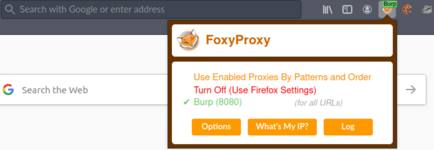
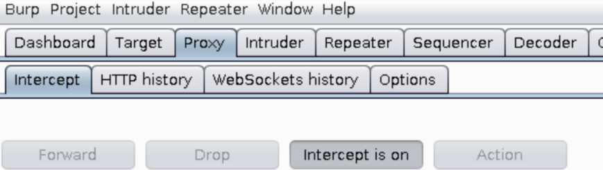
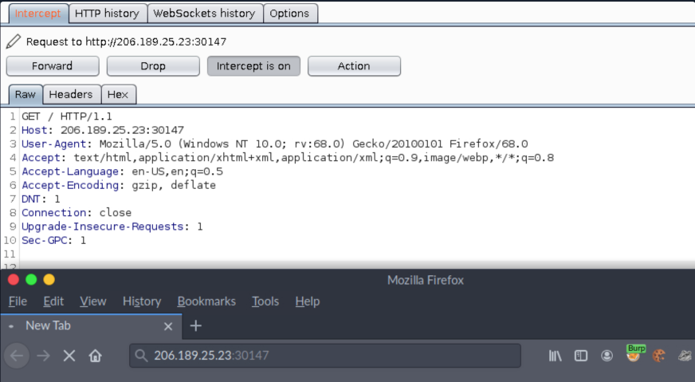
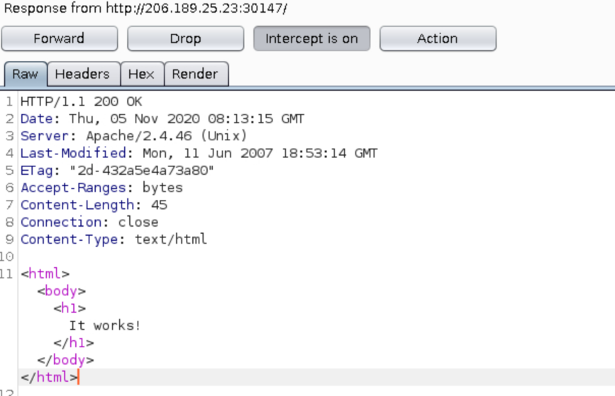
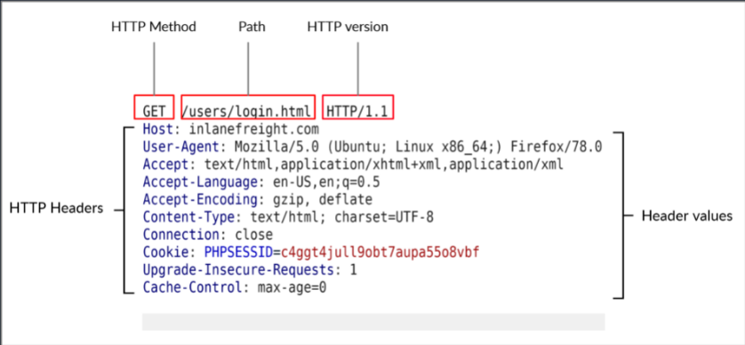
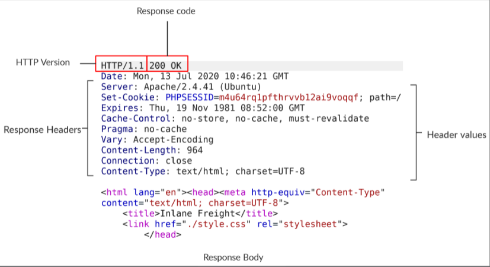

## Request and Response
## SOURCE: HTB Academy

## Setting up Burp Suite

- Burp Suite is a tool that acts as a **proxy server** and can be used to examine and modify HTTP requests.

- It provides a proxy that can route traffic from the browser through the proxy and view the various requests and responses between the client (web browser) and the webserver.

- Install the Burpsuite if you don't have it and then Open it, Close any of the prompts and then click on **Next > Start Project.**

- Now open Firefox and install **FoxyProxy** extension and click on it. Choose **Burp** from the list; this is the Burp proxy, which our requests will be routed through.

- In Burp, click on the **Proxy** tab and ensure that the **Intercept is on** button is enabled. Click on **Forward** in case the request box is populated already until it's empty.

- Switch to the browser and enter the target URL into the URL bar (**http://SERVER_IP:PORT** as will be shown in the exercise at the end).

- After this, the request should be intercepted by Burp and appear as above. In order to intercept responses, click on **Options** and tick **Intercept Server responses.**

- Now go back to the **Proxy** tab and click on **Forward** to forward the server's request.

- This should present us with the server response, as shown above. Click on **Forward** to forward this to the browser.

**HTTP Request**

- Let's look at a raw HTTP request, as seen from Burp.

- The image above shows an HTTP GET request to the URL:
	- https://inlanefreight.com/users/login.html

- The first line of an HTTP request contains three fields separated by spaces.

| **Field** | **Description**
|-----------|----------------
| Method | The first field stands for the HTTP method or verb, which specifies the type of action to perform.
| Path | The second field is the path to the resource being accessed. This field can also be suffixed with a query string.
| Version | The third and final is used to denote the HTTP version.

- The next set of lines contain HTTP header value pairs. These are used to specify various attributes of a reequest. The headers are terminated with a new line, which is necessary for the server to validate the request.

- This can be followed by the request body, which we will analyze in later sections of this module.

## HTTP Response

Next, let's look at a raw HTTP response.

- Similar to the request, an HTTP response contains headers as well. The first line contains tow fields separated by spaces.

- The first being the HTTP version, while the second denotes the HTTP response code. Response codes are used to determine if a request succeeded or not.

- The response body is present after the headers, separated by a new line. The response body is usually defined as HTML code.

- However, it can also respond with other code types such as JSON, website resources such as images, style sheets or scripts, or even a document such as a PDF document hosted on the webserver.

