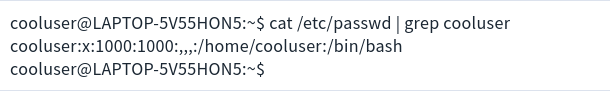
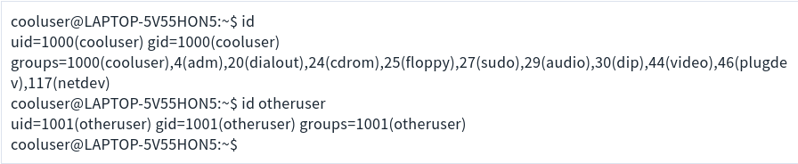

**What is Uid and Gid?**

- The root user and group are usually given uid and gid 0. The IDs form 1-99 are also reserved for use by other system accounts.

- What happens after 99 tends to vary by operating system. For example, some flavors of Unix reserve 100-499 for dynamic system allocation ( e.g. if a package you install needs a uid/gid) and begin allocating standard user accounts uid and gid numbers at 500.

- Other systems, reserve 100-999 for dynamic system allocation and start standard user accounts from 1,000 and up.

- Uid and Gid matter for more than just identifying users and groups. When a process is started or a command is run, the uid or gid that called it dictates privileges and file system access.

- For example, uid and gid values help your **Linux system** differentiate between root and a user with lower privileges.

**How to Display a Uid and Gid?**

- There are a few ways to view a uid and gid. One of the simplest is looking at the /etc/passwd file available on most Linux operating systems. In the /etc/passwd file the uid is the 3rd field and the gid is the 4th.

- For example, on your **Ubuntu** 20.04 system where "cooluser" was the first account created, we can see the cooluser's uid and gid are 1000.

- You can check the gid and uid of your current user or other users with the aptly named **id** command. In the examples below, we use **id** to check our own uid and gid as well as the uid and gid of ""otheruser" with the command **id otheruser**.

- You'll notice that there are multiple groups in **id cooluser** command. This is because the **id** command prints the real uid/gid, the effective uid/gid usually the same as the real uid/gid, but not always, and supplementary group IDs.

- These values come into play once you dive into file permissions and concepts like setuid.
