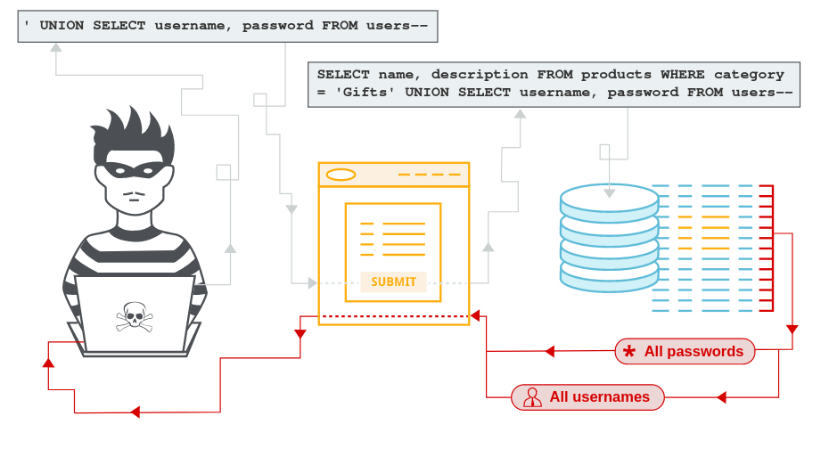

[**source**](https://portswigger.net/web-security/sql-injection)

## SQL Injection
- SQL injection (SQLi) is a web security vulnerability that allows an attacker to interfere with the queries that an application makes to its database. It generally allows an attacker to view data that they are not normally able to retrieve. This might include data belonging to other users, or any other data that the application itself is able to access. In many cases, an attacker can modify or delete this data, causing persistent changes to the application's content or behavior. 

## What is the impact of a successful SQL injection attack?

A successful SQL injection attack can result in unauthorized access to sensitive data, such as passwords, credit card details, or personal user information. Many high-profile data breaches in recent years have been the result of SQL injection attacks, leading to reputational damage and regulatory fines. 

- In some cases, an attacker can obtain a persistent backdoor into an organization's systems, leading to a long-term compromise that can go unnoticed for an extended period.

## SQL injection examples

There are a wide variety of SQL injection vulnerabilities, attacks, and techniques, which arise in different situations. Some common SQL injection examples include:

-   [Retrieving hidden data](https://portswigger.net/web-security/sql-injection#retrieving-hidden-data), where you can modify an SQL query to return additional results.
-   [Subverting application logic](https://portswigger.net/web-security/sql-injection#subverting-application-logic), where you can change a query to interfere with the application's logic.
-   [UNION attacks](https://portswigger.net/web-security/sql-injection/union-attacks), where you can retrieve data from different database tables.
-   [Examining the database](https://portswigger.net/web-security/sql-injection/examining-the-database), where you can extract information about the version and structure of the database.
-   [Blind SQL injection](https://portswigger.net/web-security/sql-injection/blind), where the results of a query you control are not returned in the application's responses.

## Retrieving hidden data

Consider a shopping application that displays products in different categories. When the user clicks on the Gifts category, their browser requests the URL:

`https://insecure-website.com/products?category=Gifts`

This causes the application to make an SQL query to retrieve details of the relevant products from the database:

`SELECT * FROM products WHERE category = 'Gifts' AND released = 1`

Going further, an attacker can cause the application to display all the products in any category, including categories that they don't know about:

`https://insecure-website.com/products?category=Gifts'+OR+1=1--`

This results in the SQL query:

`SELECT * FROM products WHERE category = 'Gifts' OR 1=1--' AND released = 1`

The modified query will return all items where either the category is Gifts, or 1 is equal to 1. Since `1=1` is always true, the query will return all items.

## Subverting application logic

- Consider an application that lets users log in with a username and password. If a user submits the username `wiener` and the password `bluecheese`, the application checks the credentials by performing the following SQL query:

`SELECT * FROM users WHERE username = 'wiener' AND password = 'bluec`

If the query returns the details of a user, then the login is successful. Otherwise, it is rejected.

- Here, an attacker can log in as any user without a password simply by using the SQL comment sequence `--` to remove the password check from the `WHERE` clause of the query. For example, submitting the username `administrator'--` and a blank password results in the following query:

`SELECT * FROM users WHERE username = 'administrator'--' AND password = ''`

This query returns the user whose username is `administrator` and successfully logs the attacker in as that user.

## Retrieving data from other database tables

- In cases where the results of an SQL query are returned within the application's responses, an attacker can leverage an SQL injection vulnerability to retrieve data from other tables within the database. This is done using the `UNION` keyword, which lets you execute an additional `SELECT` query and append the results to the original query.
- For example, if an application executes the following query containing the user input "Gifts":

`SELECT name, description FROM products WHERE category = 'Gifts'`

then an attacker can submit the input:

`' UNION SELECT username, password FROM users--`

This will cause the application to return all usernames and passwords along with the names and descriptions of products. 

## Examining the database