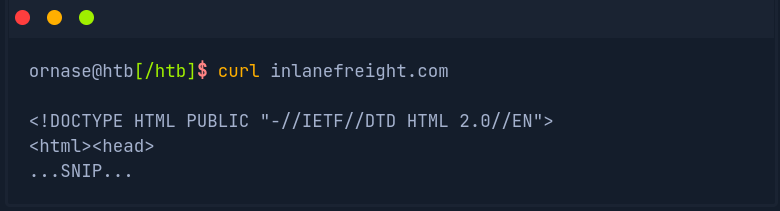
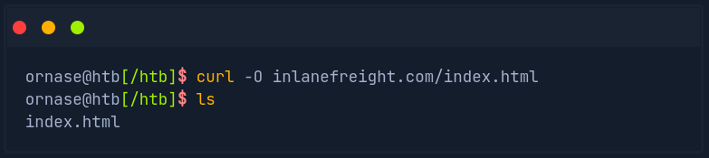
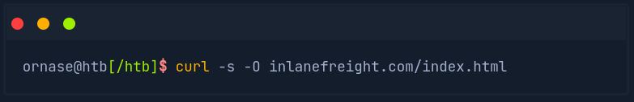
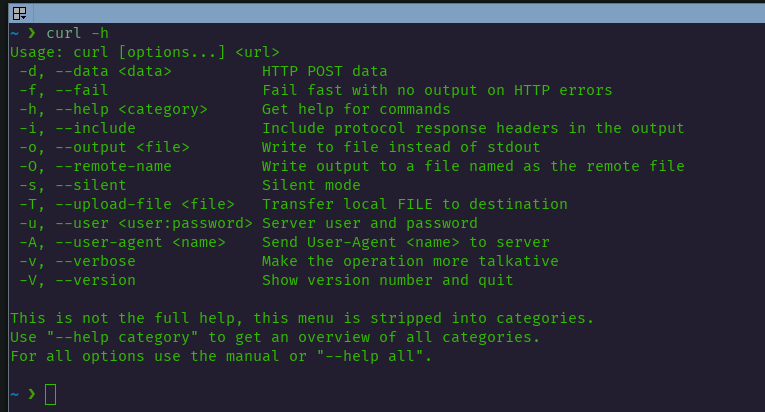
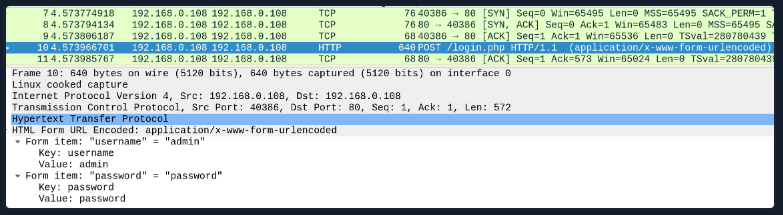
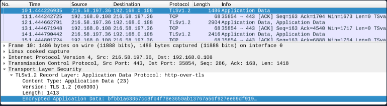
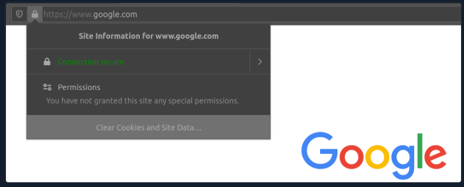
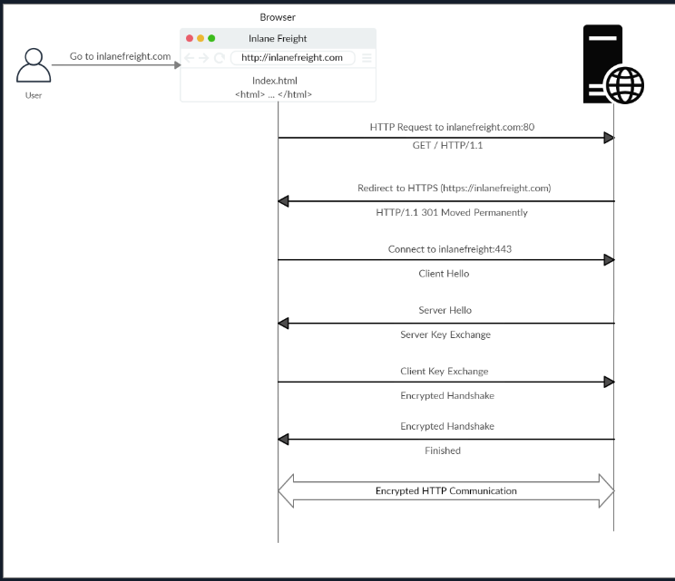
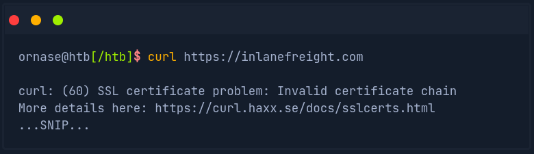
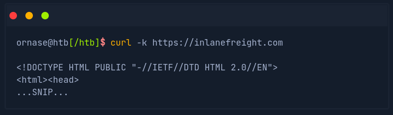

# Web Request

## SOURCE: HTB ACADEMY

## HyperText Transfer Protocol (HTTP)

- **HTTP** is an application-level protocol used to access resources over the World Wide Web. The term **hypertext** stands for text containing links to other resources and text that can be easily interpreted by the readers.

- HTTP communication consists of a client and a server, where the client requests server for a resources. The server processes the requests and returns the requested resource.

- The default port for HTTP communication is 80; however, this can be changed. These are the requests to the web servers that we know when using the Internet to visit different websites.

- We enter a **Fully Qualified Domain Name (FQDN) as a Uniform Resources Locator (URL)** to reach the website, like www.google.com.

- The **URL** offers us much more possibilities than just specifying the website we want to visit. Resources over HTTP are accessed via a URL. Let's look at the structure of a URL.

| **Component** | **Description**
| --------------|----------------
| Scheme | This is used to identify the protocol being accessed by the client. This is usually **http** or **https**.
| User Info | This is an optional component that contains credentials in the form **username:password**, which is used to authenticate to the host.
| Host | The host signifies the resource location. This can be a hostname or an IP address. A colon separates to host and port.
| Port | URLs without a port specified point to the default port 80. If the HTTP server port isn't running on port 80, it can be specified, the server returns the default index document hosted by it ( for example, index.html).
| Path | This points to the resource being accessed, which can be a file or a folder, If there no path specified, the server returns the default index document hosted by it ( for example, index.html).
| Query String | The query string is preceded by a question mark (?). This is another optional component that is used to pass information to the resource. A query string consists of a parameter and a value. In the example above, the parameter is **login**, and its **value** is true. There can be multiple parameters separated by an ampersand (&).
| Fragments | This is processed by browsers on the client-side to locate sections withing the primary resource.

- Not all components are always required to access a resource. However, a URL should at least contain a scheme and host to make a proper request.

## HTTP Flow

- The first time user enters a URL (inlanefreight.com) into the browser, it requests a DNS (Domain Name Resolution) server to resolve the domain.

- The DNS server looks up the IP address for **inlanefreight.com** and returns it. All domain names need to be resolved this way, as a server can't communicated without an IP address.

- Next, the browser sends a GET request to the default HTTP port, i.e., 80, asking for the root **/** folder.

- Here **GET** is the request method. The type of request can vary , as well as we'll see later. The web server receives the request and processes it. By default, servers are configured to return an index file when a request for **/** is received.

- In this case, the contents of **index.html** are read and returned by the webserver as an HTTP response.

- The response also contains information such as the status code **200 OK**, meaning the request processed successfully.

- The **index.html** contents are then rendered by the web browser and presented to the user. **HTML (HyperText Markup Language)** is a client-side language that is understood and processed by browsers. It is the standard **markup language** to display documents via a web browsers.

- HTML pages are assisted by **Cascading Style Sheets (CSS)**, which allow flexibility for applying presentation elements such as layout, colors, and fonts to one or multiple web pages as well as cripting languages such as **javascript** which enable interactive web pages.

## cURL

- **cURL** (client URL) is a command-line tool and library that primarily supports HTTP along with many other protocols. This makes it a good candidate for scripts as well as automation, making it essential for sending various types of web requests from the command line, which is necessary for many types of web penetration tests.

- We can send a basic HTTP request to any URL by using it as an argument for cURL, as follows:

- We see that cURL does not render the HTML/JavaScript/CSS code, unlike a web browser, but prints it in its raw format. 

**We are mainly interested in the REQUEST and RESPONSE context.**

- We may also use cURL to download a page or a file and output the content into a file using the **-O** flag. If we want to specify the output file name, we can use the **-o** flag and specify the name. Otherwise, we can **-O** and cURL will use the remote file name, as follows:

- As we can see, the output was not printed this time but rather saved into **index.html**. We noticed that cURL still printed some status while processing the request. We can silent the status with the **-s** flag, as follows:

- This time, cURL did not print anything, as the output was saved into the **index.html** file. Finally, we may use the **-h** flag to see what other options we may use with cURL:

## Hypertext Transfer Protocol Secure (HTTPS)

- To counter this issue, the **HTTPS (HTTP Secure) protocol** was created, in which all communications are transferred in an encrypted format, so even if a third party does intercept the request, they would not be able to extract the data out of it.

- For this reason, HTTPS has become the mainstream scheme for websites on the internet, HTTP is being phased out, and soon most web browsers will not allow visiting HTTP websites.

## HTTPS Overview:

- If examine the HTTP request, we can see the effect of not enforcing secure communications between a web-browser and a web-application. For example, the following is the content of an HTTP login request: 

- We can see that the login credentials can be viewed in clear-text. This would make it easy for someone on the same network (such as a public wireless network) to capture the request and reuse the credentials for malicious purposes.

- In contrast, when someone intercepts and analyzes traffic from an HTTPS request, they would see something like the following.

- As we can see, the data is transferred as a single encrypted stream, which makes it very difficult for anyone to capture information such as credentials or any other sensitive data.

- Websites that enforce HTTPS can be identified through **https://** in their URL (e.g. https://google.com), as well as the lock icon in the address bar of the web browser, to the left of the URL:

- So if we visit a website that utilized HTTPS, like Google, all traffic would be encrypted.

**Note**: Although the data transferred through the HTTPS protocol may be enrypted, the request may still reveal the visited URL if it contacted a clear-text DNS server. For this reason, it is recommended to utilize encrypted DNS servers (e.g. 8.8.8.8 or 1.2.3.4), or utilize a VPN service to ensure all traffic is properly encrypted.

## HTTPS Flow

- Let's look at how HTTPS operated at a high level:

- If we type **http://** instead of **https://** to visit a website that enforces HTTPS, the browser attempts to resolve the domain and redirects the user to the webserver hosting the target website.

- A request sent to port **80** first, which is the unecrypted HTTP protocol. The server detects this and redirects the client to secure HTTPS port **443** instead.

- This is done via the **301 Moved Permanently** response code.

- Next, the client (web-browser) sends a "client hello" packet, giving information about itself. After this, the server replies with "server hello", followed by a **key exchange** to exchange SSL certificates.

- The client verifies the key/certificate and sends one of its own.

- After this, an encrypted **handshake** is initiated to confirm whether the encryption and transfer are working correctly.

- Once the handshake completes successfully, normal HTTP communication is continued, which is encrypted after that. This is a very high-level overview of the key exchange, which is beyond this module's scope.

**Note:** Depending on the circumstances, an attacker may be able to perform an HTTP downgrade attack, which downgrades HTTPS communication to HTTP, making the data transferred in clear-text. This is done by setting up a Man-In-The-Middle (MITM) proxy to transfer all traffic through the attacker's host without the user's knowledge. However, most modern browsers, servers, and web applications protect against this attack.

## cURL for HTTPS

- cURL should automatically handles all HTTPS communication standards and perform a secure handshake and then encrypt and decrypt data automatically.

- However, if we ever contact a website with an invalid SSL certificate or an outdated one, then cURL by default would not proceed with the communication to protect against the earlier mentioned MITM attacks:

- Modern web browser would do the same, warning the user against visiting a website with an invalied SSL certificate.

- We may face such an issue when testing a local web application or with a web application hosted for practice puposes, as such web applications may not yet have implemented a valid SSL certificate.

- To skip the certificate check with cURL, we can use the **-k** flag:

- As we can see, the request went through this time, and we received the response data.
