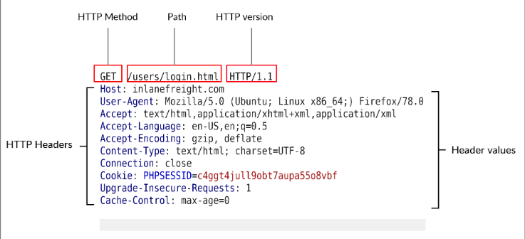
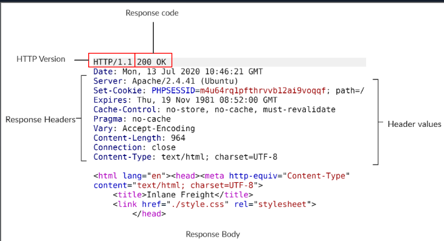
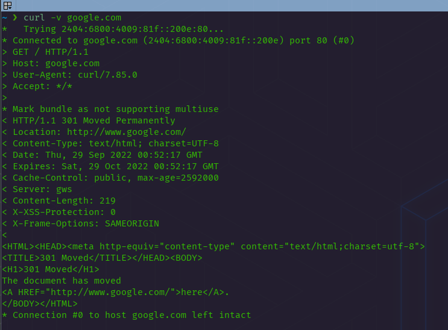
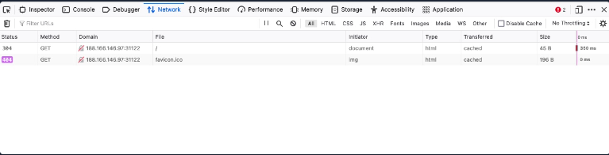
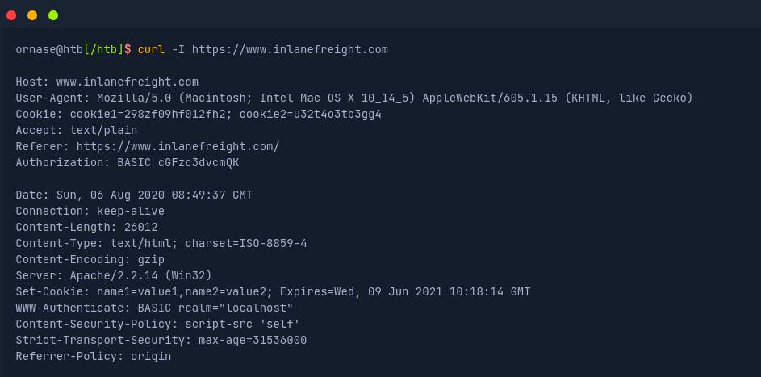
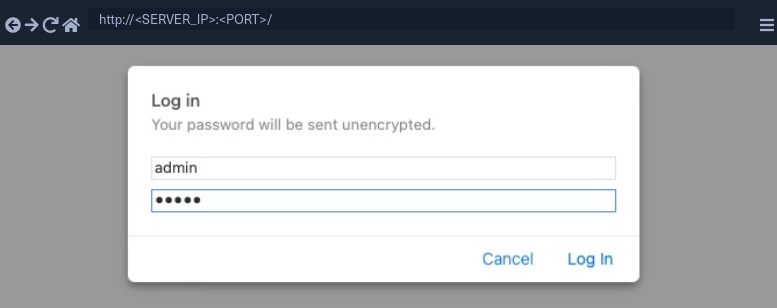
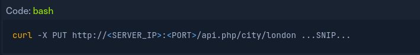

# Web Request

## SOURCE: HTB ACADEMY

## HyperText Transfer Protocol (HTTP)

- **HTTP** is an application-level protocol used to access resources over the World Wide Web. The term **hypertext** stands for text containing links to other resources and text that can be easily interpreted by the readers.

- HTTP communication consists of a client and a server, where the client requests server for a resources. The server processes the requests and returns the requested resource.

- The default port for HTTP communication is 80; however, this can be changed. These are the requests to the web servers that we know when using the Internet to visit different websites.

- We enter a **Fully Qualified Domain Name (FQDN) as a Uniform Resources Locator (URL)** to reach the website, like www.google.com.

- The **URL** offers us much more possibilities than just specifying the website we want to visit. Resources over HTTP are accessed via a URL. Let's look at the structure of a URL.

| **Component** | **Description**
| --------------|----------------
| Scheme | This is used to identify the protocol being accessed by the client. This is usually **http** or **https**.
| User Info | This is an optional component that contains credentials in the form **username:password**, which is used to authenticate to the host.
| Host | The host signifies the resource location. This can be a hostname or an IP address. A colon separates to host and port.
| Port | URLs without a port specified point to the default port 80. If the HTTP server port isn't running on port 80, it can be specified, the server returns the default index document hosted by it ( for example, index.html).
| Path | This points to the resource being accessed, which can be a file or a folder, If there no path specified, the server returns the default index document hosted by it ( for example, index.html).
| Query String | The query string is preceded by a question mark (?). This is another optional component that is used to pass information to the resource. A query string consists of a parameter and a value. In the example above, the parameter is **login**, and its **value** is true. There can be multiple parameters separated by an ampersand (&).
| Fragments | This is processed by browsers on the client-side to locate sections within the primary resource.

- Not all components are always required to access a resource. However, a URL should at least contain a scheme and host to make a proper request.

## HTTP Flow

- The first time user enters a URL (inlanefreight.com) into the browser, it requests a DNS (Domain Name Resolution) server to resolve the domain.

- The DNS server looks up the IP address for **inlanefreight.com** and returns it. All domain names need to be resolved this way, as a server can't communicated without an IP address.

- Next, the browser sends a GET request to the default HTTP port, i.e., 80, asking for the root **/** folder.

- Here **GET** is the request method. The type of request can vary , as well as we'll see later. The web server receives the request and processes it. By default, servers are configured to return an index file when a request for **/** is received.

- In this case, the contents of **index.html** are read and returned by the webserver as an HTTP response.

- The response also contains information such as the status code **200 OK**, meaning the request processed successfully.

- The **index.html** contents are then rendered by the web browser and presented to the user. **HTML (HyperText Markup Language)** is a client-side language that is understood and processed by browsers. It is the standard **markup language** to display documents via a web browsers.

- HTML pages are assisted by **Cascading Style Sheets (CSS)**, which allow flexibility for applying presentation elements such as layout, colors, and fonts to one or multiple web pages as well as scripting languages such as **javascript** which enable interactive web pages.

## cURL

- **cURL** (client URL) is a command-line tool and library that primarily supports HTTP along with many other protocols. This makes it a good candidate for scripts as well as automation, making it essential for sending various types of web requests from the command line, which is necessary for many types of web penetration tests.

- We can send a basic HTTP request to any URL by using it as an argument for cURL, as follows:

- We see that cURL does not render the HTML/JavaScript/CSS code, unlike a web browser, but prints it in its raw format. 

**We are mainly interested in the REQUEST and RESPONSE context.**

- We may also use cURL to download a page or a file and output the content into a file using the **-O** flag. If we want to specify the output file name, we can use the **-o** flag and specify the name. Otherwise, we can **-O** and cURL will use the remote file name, as follows:

- As we can see, the output was not printed this time but rather saved into **index.html**. We noticed that cURL still printed some status while processing the request. We can silent the status with the **-s** flag, as follows:

- This time, cURL did not print anything, as the output was saved into the **index.html** file. Finally, we may use the **-h** flag to see what other options we may use with cURL:

## Hypertext Transfer Protocol Secure (HTTPS)

- To counter this issue, the **HTTPS (HTTP Secure) protocol** was created, in which all communications are transferred in an encrypted format, so even if a third party does intercept the request, they would not be able to extract the data out of it.

- For this reason, HTTPS has become the mainstream scheme for websites on the internet, HTTP is being phased out, and soon most web browsers will not allow visiting HTTP websites.

## HTTPS Overview:

- If examine the HTTP request, we can see the effect of not enforcing secure communications between a web-browser and a web-application. For example, the following is the content of an HTTP login request: 

- We can see that the login credentials can be viewed in clear-text. This would make it easy for someone on the same network (such as a public wireless network) to capture the request and reuse the credentials for malicious purposes.

- In contrast, when someone intercepts and analyzes traffic from an HTTPS request, they would see something like the following.

- As we can see, the data is transferred as a single encrypted stream, which makes it very difficult for anyone to capture information such as credentials or any other sensitive data.

- Websites that enforce HTTPS can be identified through **https://** in their URL (e.g. https://google.com), as well as the lock icon in the address bar of the web browser, to the left of the URL:

- So if we visit a website that utilized HTTPS, like Google, all traffic would be encrypted.

**Note**: Although the data transferred through the HTTPS protocol may be enrypted, the request may still reveal the visited URL if it contacted a clear-text DNS server. For this reason, it is recommended to utilize encrypted DNS servers (e.g. 8.8.8.8 or 1.2.3.4), or utilize a VPN service to ensure all traffic is properly encrypted.

## HTTPS Flow

- Let's look at how HTTPS operated at a high level:

- If we type **http://** instead of **https://** to visit a website that enforces HTTPS, the browser attempts to resolve the domain and redirects the user to the webserver hosting the target website.

- A request sent to port **80** first, which is the unecrypted HTTP protocol. The server detects this and redirects the client to secure HTTPS port **443** instead.

- This is done via the **301 Moved Permanently** response code.

- Next, the client (web-browser) sends a "client hello" packet, giving information about itself. After this, the server replies with "server hello", followed by a **key exchange** to exchange SSL certificates.

- The client verifies the key/certificate and sends one of its own.

- After this, an encrypted **handshake** is initiated to confirm whether the encryption and transfer are working correctly.

- Once the handshake completes successfully, normal HTTP communication is continued, which is encrypted after that. This is a very high-level overview of the key exchange, which is beyond this module's scope.

**Note:** Depending on the circumstances, an attacker may be able to perform an HTTP downgrade attack, which downgrades HTTPS communication to HTTP, making the data transferred in clear-text. This is done by setting up a Man-In-The-Middle (MITM) proxy to transfer all traffic through the attacker's host without the user's knowledge. However, most modern browsers, servers, and web applications protect against this attack.

## cURL for HTTPS

- cURL should automatically handles all HTTPS communication standards and perform a secure handshake and then encrypt and decrypt data automatically.

- However, if we ever contact a website with an invalid SSL certificate or an outdated one, then cURL by default would not proceed with the communication to protect against the earlier mentioned MITM attacks:

- Modern web browser would do the same, warning the user against visiting a website with an invalied SSL certificate.

- We may face such an issue when testing a local web application or with a web application hosted for practice puposes, as such web applications may not yet have implemented a valid SSL certificate.

- To skip the certificate check with cURL, we can use the **-k** flag:

- As we can see, the request went through this time, and we received the response data.

## HTTP Requests and Responses

- HTTP communications mainly consist of an HTTP request and an HTTP response. An HTTP request is made by the client (e.g. cURL/browser), and is processed by the server (e.g. Web Server).

- The request contain all of the details we require from the server, including the resource (e.g. URL, path, parameters), any request data, headers or options.

- Once the server receives the HTTP request, it processes it and responds by sending the HTTP response, which contains the response code, as discussed in a later section, and may contain the resource data if the requester had access to it.

## HTTP Request

- The image above shows an HTTP GET request to the URL:

- **http://inlanefreight.com/users/login.html**

- The first line of any HTTP request contains three main fields'separated by spaces':

| **Field** | **Example** | **Decription** |
|-----------|-------------|----------------|
| Method | GET | The HTTP method or verb, which specifies the type of action to perform. |
| Path | /users/login.html | The path to the resource being accessed. This field can also be suffixed with a query string (e.g. ? username=user)
| Version | HTTP/1.1 | The third and final field is used to denote the HTTP version |

- The Next set of lines contain HTTP header value pairs, like **Host**, **User-Agent**, **Cookie**, and many other possible headers. These headers are used to specify various attributes of a request.

- The headers are terminated with a new line, which is necessary for the server to validate the request. Finally, a request may end with the request body and data.

**Note**: HTTP version 1.X sends requests as clear-text, and uses a new-line character to separate different fields and different requests. HTTP version 2.X, on other hand, sends requests as binary data in a dictionary form.

## HTTP Response

- Once the server processes our request, it sends its response. The following is an example HTTP response:

- The first line of an HTTP response contains two fields separated fields by spaces. The first being the **HTTP version** (e.g **HTTP/1.1**), and the second denotes the **HTTP response code** (e.g. **200 OK**).

- Response codes are used to determine the request's status. After the first line, response lists its headers, similar to an HTTP request.

- Finally, the reponse may end with a response body, which is separated by a new line after the headers. The responses body is usually defined as **HTML** code. However, it can also respond with other code types such as **JSON**, website resources such as images, style sheets or scripts, or even a document such as a PDF document hosted on the webserver.

## cURL

- In our earlier examples with cURL, we only specified the URL and got the response body in return. However, cURL also allows us to preview the full HTTP request and the full HTTP response.

- As we can see, this time, we get the full HTTP request and response. The request simply sent **GET / HTTP/1.1** along with the **Host, User-Agent** and **Accept** headers. In return, the HTTP response contained the **HTTP/1.1 401 Unauthorized**, which indicates that we do not have access over the requested resource, as we will see in an upcoming section.

- Similar to the request, the response also contained several headers sent by the server, including **Date, Content-Length,** and **Content-Type**. 

Finally, the response contained the response body in HTML, which is the same one we received earlier using cURL without the **-v** flag.

**Exercise**: The **-vv** flag shows an even more verbose output. Try to use this flag to see what extra request and response details get displayed with it.

## Browser DevTools

- Most modern web-browsers come with built-in developer tools (**DevTools**), which are mainly intended for developers to test their web applications.

- To open a the browser devetools in either Chrome or Firefox, we can press [**CTRL+SHIFT+I**] or by simply pressing [**F12**] on our keyboard.

- The devtools contain multiple tabs, each of which has its own use. We will mostly be focusing on the **Network Tab** here, as it is responsible for web requests.

- If we click on the Network tab and refresh the page, we should be able to see the list of requests sent by the page:

- As we can see, the devtools show us at a glance the response status (i.e. response code), the request method used (**GET**), the requested resource (i.e. URL/domain), along with the requested path. Futhermore, we can use **Filter URLs** to search for a specific request, in case the website loads too many to go through.

## HTTP Headers

- Headers can have on or multiple values, appended after the header name and separated by a colon. We can divide headers into the following categories:

1. **General Headers**
2. **Entity Headers**
3. **Request Headers**
4. **Response Headers**
5. **Security Headers**

## General Headers

- **General Headers** are used in both HTTP requests and responses. They are contextual and are used to **describe the message rather than its contents**.

| **Headers** | **Example** | **Description** |
|-------------|-------------|-----------------|
| Date | Date: Wed, 16 Feb 2022 10:38:44 GMT | Holds the date and time at which the message originated it's preferred to convert the time to the standard **UTC** time zone. |
| Connection | Connection: close | Dictates if the current network connection should stay alive after the request finishes. Two commonly used values for this header are **close** and **keep-alive**. The **close** value from either the client or server means that they would like to terminate the connection, while the **keep-alive** header indicates that the connection should remain open to receive more data and input. |

## Entity Headers

- Similar to general headers, **Entity Headers** can be **common to both request and response.** These headers are used to **describe the content** (entity) transferred by a message. They usually found in responses and POST and PUT requests.

| **Header** | **Example** | **Description** |
|------------|-------------|-----------------|
| Content-Type | Media-Type: application/pdf | The **media-type** is similar to **Content-Type**, and describes the data being transferred. This header can play a crucial role in making the server interpret our input. The **charset** field may also be used with this header. |
| Boundary | boundary="b4e4fbd93540" | Acts as a maker to separate content when there is more than one in the same message. For example, within a form data, this boundary gets used as **--b4e4fbd93540** to separate different parts of the form. |
| Content-Length | Content-Length:385 | Holds the size of the entity being passed. This header is necessary as the server uses it to read data from the message body, and is automatically generated by the browser and tools like cURL. |
| Content-Encoding | Content-Encoding: gzip | Data can undergo multiple transformations before being passed. For example, large amounts of data can be compressed to reduce the message size. The type of encoding being used should be specified using the **Content-Encoding** header. |

## Request Headers

- The client sends **Request Headers** in an HTTP transaction. These headers are **used in an HTTP request and do not relate to the content** of the message. The following headers are commonly seen in HTTP requests.

| **Header** |  **Example** | **Description** |
|------------|--------------|-----------------|
| Host | Host: www.inlanefreight.com | Used to specify the host being queried for the resource. This can be a domain name or an IP address. HTTP servers can be configured to host different websites, which are revealed based on the hostname. This makes the host header an important enumeration target, as it can indicate the existence of other hosts on the target server. |
| User-Agent | User-Agent: curl/7.77.0 | The **User-Agent** header is used to describe the client requesting resources. This header can reveal a lot about the client, such as the browser, its version, and the operating system. |
| Referer | Referer: http://inlanefreight.com/ | Denotes where the current request is coming from. For example, clicking a link from Google search results would make **http://google.com/** the referer. Trusting this header can be dangerous as it can be easily manipulated, leading to unintended consequences. |
| Accept | Accept: \*/\* |  The **Accept** header describes which media types the client can understand. It can contains multiple media types separated by commas. The \*/\* value signifies that all media types are accepted. |
| Cookie | Cookie: PHPSESSID=b4e4fbd93540 | Contains cookie-value pairs in the format **name=value**. A **cookie** is a piece of data stored on the client-side and on the server, which acts as an identifier. These are passed to the server per request, thus mainting the client's access. Cookies can also serve other purposes, such as saving user prefrences or session tracking. There can be multiple cookies in a single header separated by a semi-colon. |
| Authorization | Authorization: BASIC cGFzc3dvcmQK | Another method for the server to identify clients. After successful authentication, the server returns a token unique to the client. Unlike cookies, tokens are stored only on the client-side and retrieved by the server per request. There are multiple types of authentication types based on the webserver and application type used. |

## Response Headers

- **Response Headers** can be **used in an HTTP response and do not relate to the content.** Certain response headers such as **Age, Location,** and **Server** are used to provide more context about the response. The following headers are commonly seen in HTTP responses.

| **Header** | **Example** | **Description** |
|------------|-------------|-----------------|
| Server | Server: Apache/2.2.14(Win32) | Contains information about the HTTP server, which processed the request. It can be used to gain information about the server, such as its version, and enumerate it futher.|
| WWW-Authenticate | WWW-Authenticate: BASIC realm="localhost" | Notifies the client about the type of authentication required to access the requested resource. |

## Security Headers

- HTTP Security Headers are **a class of response headers used to specify certain rules and policies** to be followed by the browser while accessing the website.

| **Header** | **Example** | **Description** |
|------------|-------------|-----------------|
| Content-Security-Policy | Content-Security-Policy: script-src 'self' | Dictates the website's policy towards externally injected resources. This could be JavaScript code as well as script resources. This headers instructs the browser to accept resources only from certain trusted domains, hence preventing attacks such as **Cross-site scripting (XSS)**.|
| Strict-Transport-Security | Strict-Transport-Security: max-age=31536000 | Prevents the browser from accessing the website over the plaintext HTTP Protocol, and forces all communication to be carried over the secure HTTPS protocol. This prevents attackers from sniffing web traffic and accessing protected information such as passwords or other sensitive data. |
| Referrer-Policy |  Referrer-Policy: origin | Dictates whether the browser should include the value specified via the the **Referer** header or not. It can help in avoiding disclosing sensitive URLs and information while browsing the website.|

**Note**: There are many other contextual headers that can be used in HTTP communications. It's also possible for applications to define custom headers based on their requirement. A complete list of standard HTTP headers can be found **here**.

## cURL

- If we were only interested in seeing the response headers, then we can use the **-I** flag to send a **HEAD** request and only display the response headers.

- We can use the **-i** flag to display both the headers and the response body. (e.g. HTML code).

- The difference between the two is that **-I** sends a **HEAD** request, while **-i** sends any request we specify and prints the headers as well.

- The following command shows an example output of using the -I flag:

## HTTP Methods and Codes

- HTTP supports multiple methods for accessing a resource. In the HTTP protocol, several request methods allow the browser to send information, forms, or files to the server.

- These methods are used, among other things, to tell server how to process the request we send and how to reply.

- With cURL, if we use **-v** to preview the full request, the first line contains the HTTP method (e.g. **GET/ HTTP/1.1**), while with browser devtools, the HTTP method is shown in the **Method** column. Furthermore, the response headers also contain the HTTP response code, which the status of processing our HTTP request.

## Request Methods

| **Method** | **Desscription** |
|------------|------------------|
| GET | Requests a specific resource. Additional data can be passed to the server via query strings in the URL (e.g. **param=value**). |
| POST | Sends data to the server. It can handle multiple types of input, such as text, PDFs, and other forms of binary data. This data is appended in the request body present after the headers. The POST method is commonly used when sending information (e.g. forms/logins) or uploading data to a website, such as images or documents. |
| HEAD | Requests the headers that would be returned multiple types of input, such as text, PDFs, and other forms of binary data. This data is appended in the request body present after the headers. The POST method is commonly used when sending information (e.g. forms/logins) or uploading data to a website, such as images or documents. |
| PUT | Creates new resources on the server. Allowing this method without proper controls can lead to uplaoding malicious resources. |
| DELETE | Deletes an existing resource on the webserver. If not properly secured, can lead to Denial of Service (DoS) by deleting critical files on the web server. |
| OPTIONS | Returns information about the server, such as the methods accepted by it. |
| PATCH | Applies partial modifications to the resource at the specified location. |

**NOTE** Most modern web applications mainly rely on the **GET** and **POST** methods. However, any web application that utilizes REST APIs also rely on **PUT** and **DELETE**, which are used to update and delete data on the API endpoint, respectively.

## Response Codes

- HTTP status codes are used to tell the client the status of their request. An HTTP serve can return five types of response codes:

| **Types** | **Description** |
|-----------|-----------------|
| 1xx | Provides information and does not affect the processing of the request. |
| 2xx | Returned when a request succeeds. |
| 3xx | Returned when the server redirects the client. |
| 4xx | Signifies improper requests **from the client**. For example, requesting a resource that doesn't exist or requesting a bad format. |
| 5xx | Returned when there is some problem **with the HTTP server** itself. |

- The following are some of the commonly seen examples from each of the above HTTP method types:

| **Codes** | **Description** |
|-----------|-----------------|
| 200 OK | Returned on a successful request, and the response body usually contains the requested resource. |
| 302 Found | Redirects the client to another URL. For example, redirecting the user to their dashboard after successful login.
| 400 Bad Request | Return on encoutering malformed requests such as requests with missing the line terminators. |
| 403 Forbidden | Signifies that the client doesn't have approporiate access to the resource. It can also be returned when the server detects malicious input from the user. |
| 404 Not found | Returned when the client requests a resource that doesn't exist on the server. |
| 500 Internal Server Error | Returned when the server cannot process the request. |

## GET

- Whenever we visit any URL, our browser default to a GET request to obtain the remote resources hosted at that URL. Once the browser receives the initial page it is requesting; it may send other requests using various HTTP methods.

- This can be observed through the Network tab in the browser devtools.

## HTTP Basic Auth

- Unlike the usual login forms, which utilize HTTP parameters to validate the user credentials (e.g. POST request), this type of authentication utilizes a **basic HTTP authentication**, which is handled directly by the webserver to protect a specific page/directory, without directly interacting with the web application.

- To access the page, we have to enter a valid pair of credentials, which are **admin:admin** in this case:

## POST

- Whenever web applications need to transfer files or move the user parameters from the URL, they utilize **POST** requests.

- Unlike HTTP **GET**, which places user parameters within the URL, HTTP **POST** places user parameters within the HTTP Request body. This has three main benefits:
  - **Lack of Logging**: As POST requests may transfer large files (e.g. file upload), it would not be efficient for the server to log all uploaded files as part of the requested URL, as would be the case with a file uploaded through a GET request.
  - **Less Encoding Requirements**: URLs are designed to be shared, which request places data in the body which can accept binary data. The only characters that need to be encoded are those that are used to separate parameters.
  - **More data can be sent**: The maximum URL Length between browsers (Chrome/Firefox/IE), web servers (IIS, Apache, nginx), Content Delivery Networks (Fastly, Cloudfront, Cloudflare), and even URL Shorteners (bit.ly, amzn.to). Generally speaking, a URL's length should be kept to below 2,000 characters, and so they cannot handle a lot of data.

## CRUD API

### APIs

- There are several types of APIs. Many APIs are used to interact with a database, such that we would be able to specify the requested table and the requested row within our API query, and then use an HTTP method to perform the operation needed. For example, for the **api.php** endpoint in our example, if we wanted to update the **city** table in the database, and the row we will be updating has a city name of **london**, then the URL would look something like this:

### CRUD

- As we can see, we can easily specify the table and the row we want to perform an operation on through such APIs. Then we may utilize different HTTP methods to perform different operations on that row. In general, APIs perform 4 main operations on the requested database entity.

| **Operation** |  **HTTP Method** | **Description** |
|---------------|------------------|-----------------|
| Create | POST | Adds the specified data to the database table |
| Read | GET | Reads the specified entity from the database table |
| Updated | PUT | Updates the data of the specified database table 
| Delete | DELETE | Removes the specified row from the database table |

- These four operations are mainly linked to the commonly know CRUD APIs, but the same principle is also used in REST APIs and several other types of APIs.

- Of course, not all APIs work in the same way, and the user access control will limit what actions we can perform and what results we can see.

