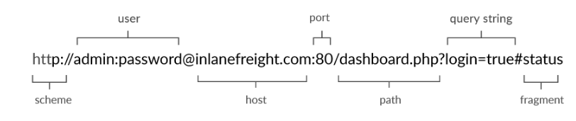
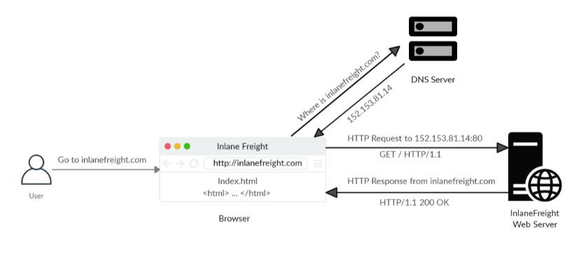

# Web Request

## SOURCE: HTB ACADEMY

## HyperText Transfer Protocol (HTTP)

- **HTTP** is an application-level protocol used to access resources over the World Wide Web. The term **hypertext** stands for text containing links to other resources and text that can be easily interpreted by the readers.

- HTTP communication consists of a client and a server, where the client requests server for a resources. The server processes the requests and returns the requested resource.

- The default port for HTTP communication is 80; however, this can be changed. These are the requests to the web servers that we know when using the Internet to visit different websites.

- We enter a **Fully Qualified Domain Name (FQDN) as a Uniform Resources Locator (URL)** to reach the website, like www.google.com.

- The **URL** offers us much more possibilities than just specifying the website we want to visit. Resources over HTTP are accessed via a URL. Let's look at the structure of a URL.

| **Component** | **Description**
| --------------|----------------
| Scheme | This is used to identify the protocol being accessed by the client. This is usually **http** or **https**.
| User Info | This is an optional component that contains credentials in the form **username:password**, which is used to authenticate to the host.
| Host | The host signifies the resource location. This can be a hostname or an IP address. A colon separates to host and port.
| Port | URLs without a port specified point to the default port 80. If the HTTP server port isn't running on port 80, it can be specified, the server returns the default index document hosted by it ( for example, index.html).
| Path | This points to the resource being accessed, which can be a file or a folder, If there no path specified, the server returns the default index document hosted by it ( for example, index.html).
| Query String | The query string is preceded by a question mark (?). This is another optional component that is used to pass information to the resource. A query string consists of a parameter and a value. In the example above, the parameter is **login**, and its **value** is true. There can be multiple parameters separated by an ampersand (&).
| Fragments | This is processed by browsers on the client-side to locate sections withing the primary resource.

- Not all components are always required to access a resource. However, a URL should at least contain a scheme and host to make a proper request.

## HTTP Flow

- The first time user enters a URL (inlanefreight.com) into the browser, it requests a DNS (Domain Name Resolution) server to resolve the domain.

- The DNS server looks up the IP address for **inlanefreight.com** and returns it. All domain names need to be resolved this way, as a server can't communicated without an IP address.

- Next, the browser sends a GET request to the default HTTP port, i.e., 80, asking for the root **/** folder.

- Here **GET** is the request method. The type of request can vary , as well as we'll see later. The web server receives the request and processes it. By default, servers are configured to return an index file when a request for **/** is received.

- In this case, the contents of **index.html** are read and returned by the webserver as an HTTP response.

- The response also contains information such as the status code **200 OK**, meaning the request processed successfully.

- The **index.html** contents are then rendered by the web browser and presented to the user. **HTML (HyperText Markup Language)** is a client-side language that is understood and processed by browsers. It is the standard **markup language** to display documents via a web browsers.

- HTML pages are assisted by **Cascading Style Sheets (CSS)**, which allow flexibility for applying presentation elements such as layout, colors, and fonts to one or multiple web pages as well as cripting languages such as **javascript** which enable interactive web pages.

