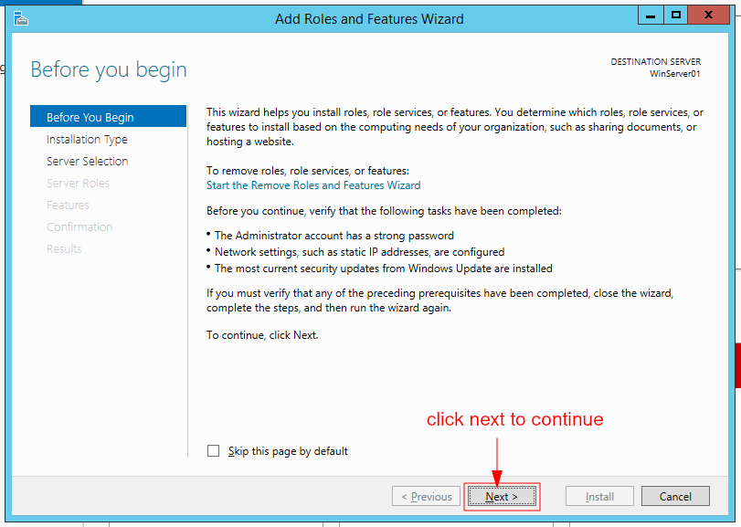
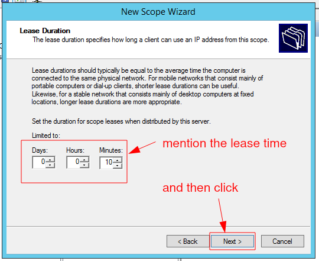
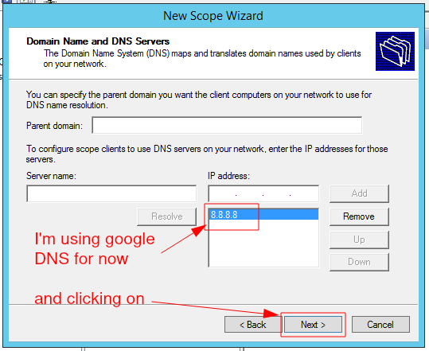
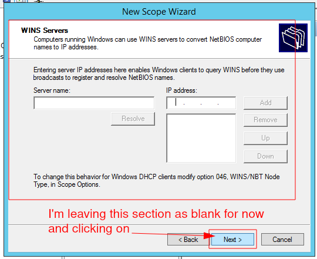
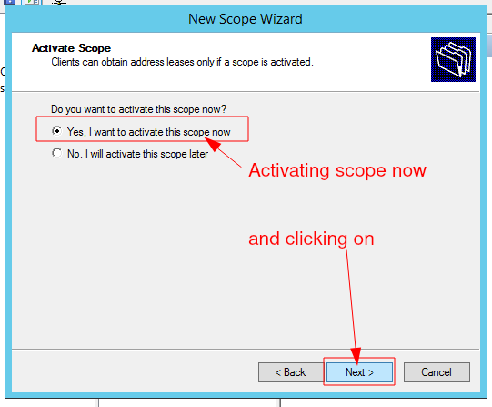
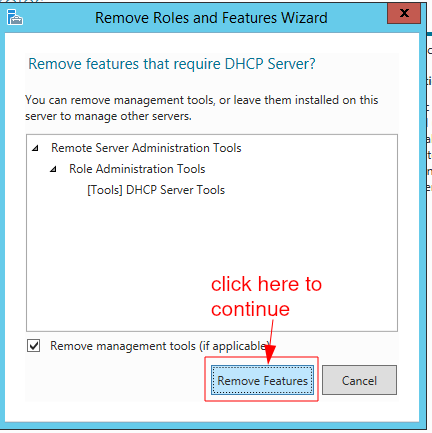
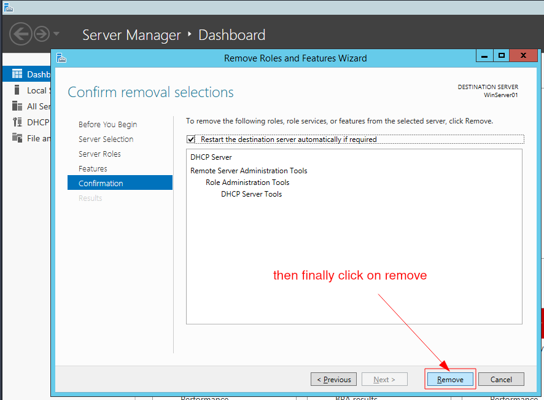

# DHCP Configuration in Windows Server 2012 R2 VM

## Hypervisor used: vmware workstation 16

## Network Connection inside vmware: LAN Segment (A private network shared with other VMs)

### Step One: Configuring VMs with vmware Network Connection to communicate properly.

- Open your Windows Server and Client VMs and go to their Network Settings
- And select **LAN Segment** Option and create LAN Segment and name it whatever u want.
- Then Save seetings and reload Server and Client VM network Adapter from their control panel.
    

    

### Step Two: Configuring DHCP Server in Windows Server 2012 R2

### Removing DHCP from Windows Server 2012 R2

