# DNS

# DNS (Domain Name System) Configuration in Windows Server 2012 R2 VM

## Hypervisor used: vmware workstation 16

### Step One: INSTALLATION

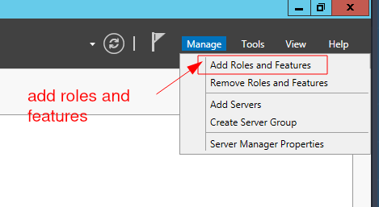

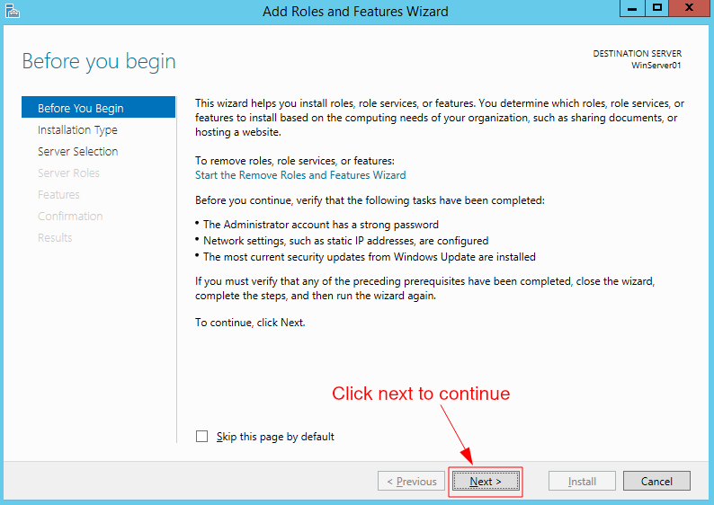

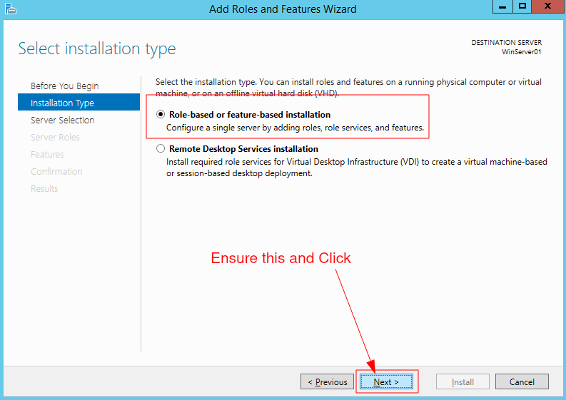

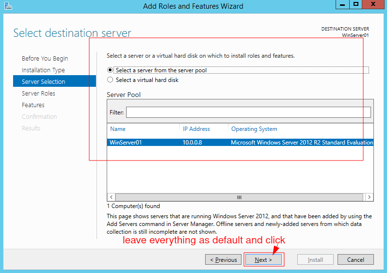

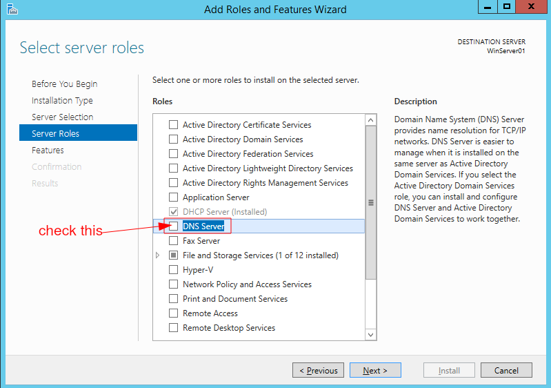

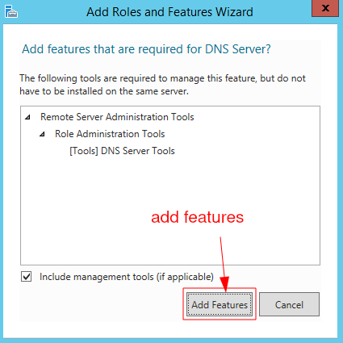

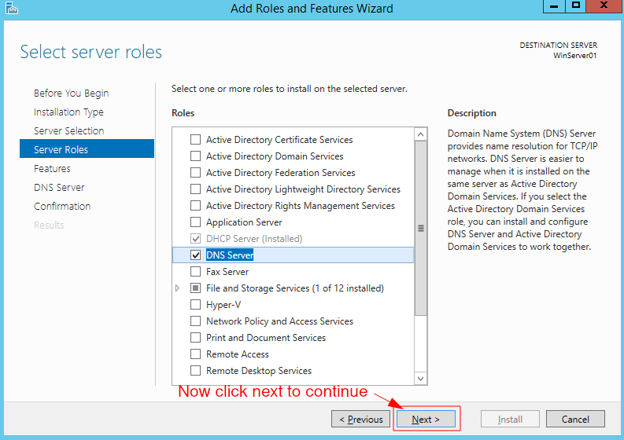

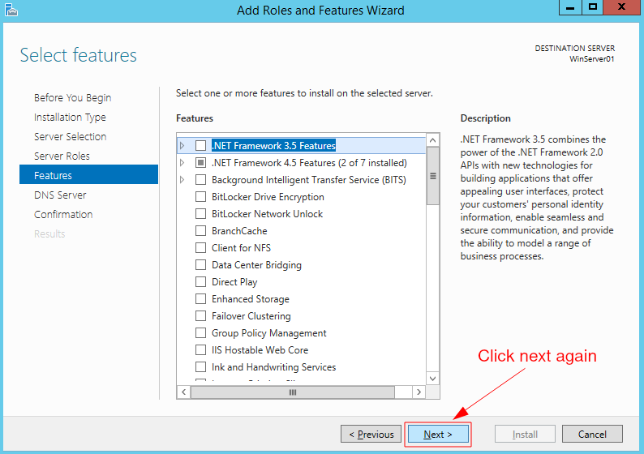

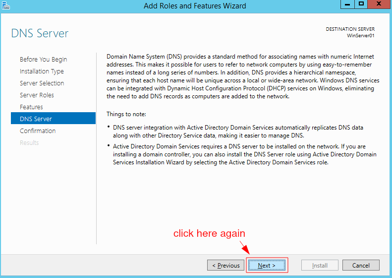

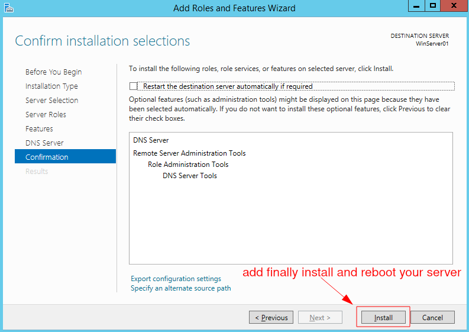

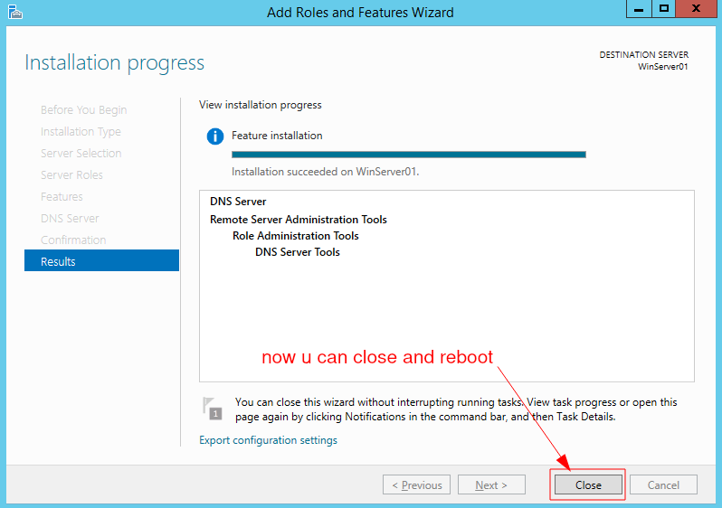

### Uninstallation

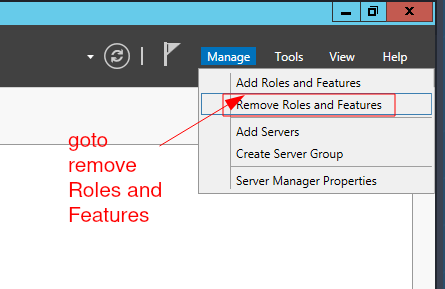

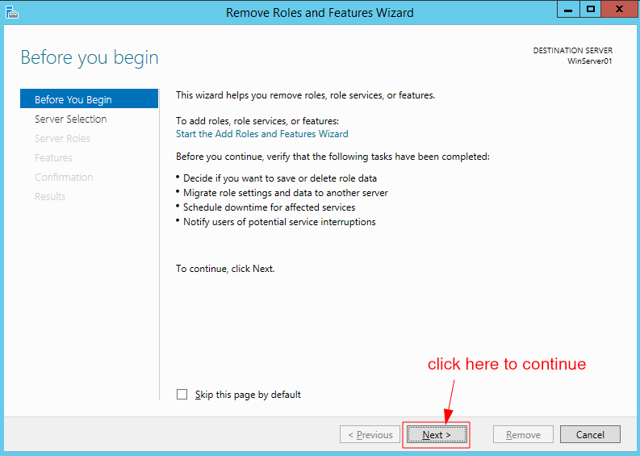

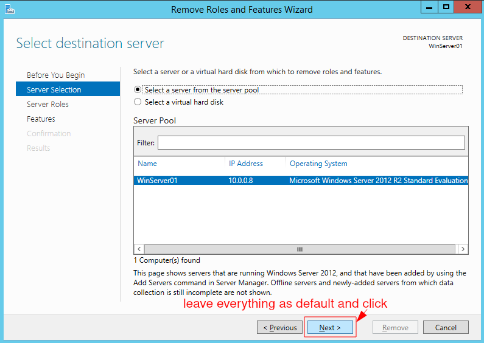

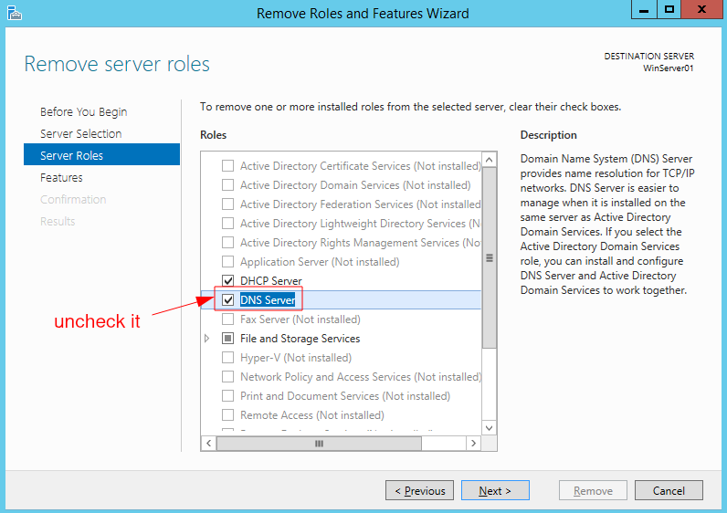

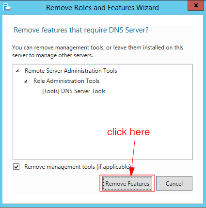

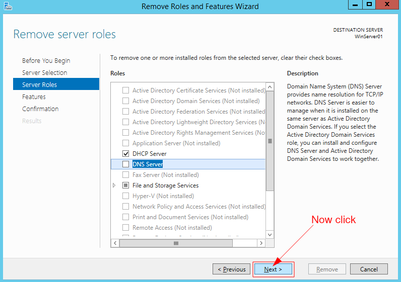

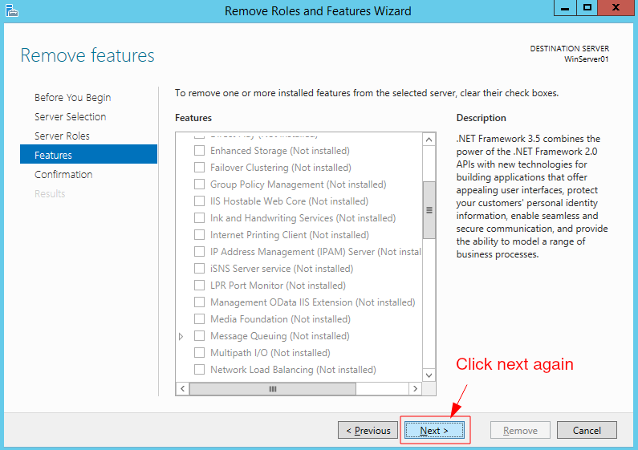

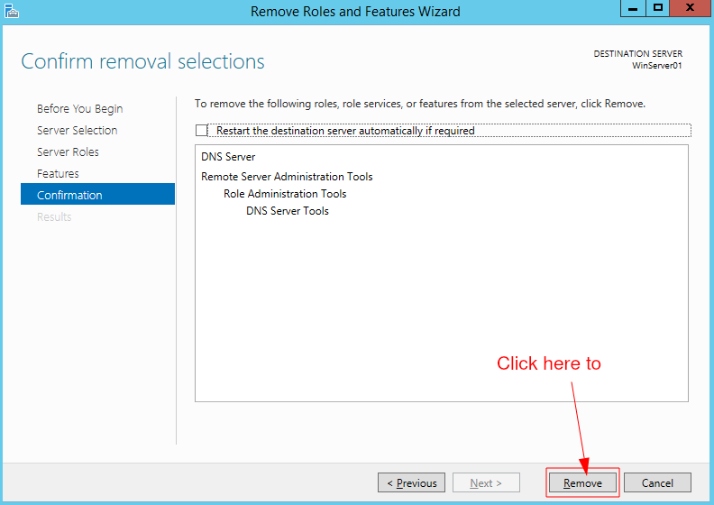

